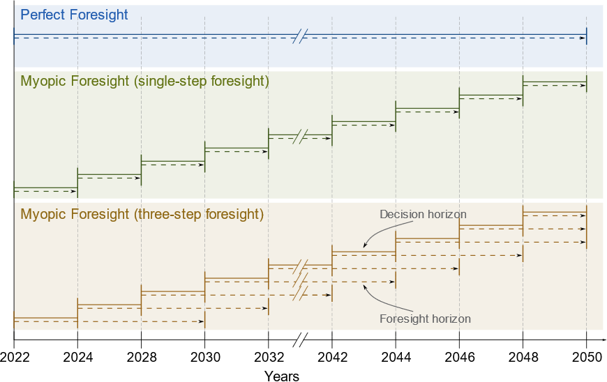

.. _dataset_examples:
################
Dataset Examples
################
ZEN-garden provides a number of small datasets to demonstrate the functionalities of ZEN-garden and to understand the data structure. The datasets are stored in the ``datasets`` directory of the ZEN-garden repository.
If you forked the ZEN-garden repository, you can find the datasets in the ``documentation/dataset_examples`` directory.
If you installed ZEN-garden using pip, you can download and execute the datasets with the ``--example`` flag (see :ref:`Run example`).

The following datasets are available:

1. ``1_base_case``
2. ``2_multi_year_optimization``
3. ``3_reduced_import_availability``
4. ``4_PWA_nonlinear_capex``
5. ``5_multiple_time_steps_per_year``
6. ``6_reduced_import_availability_yearly``
7. ``7_time_series_aggregation``
8. ``8_yearly_variation``
9. ``9_myopic_foresight``
10. ``10_brown_field``
11. ``11_multi_scenario``
12. ``12_multiple_in_output_carriers_conversion``
13. ``13_yearly_interpolation``
14. ``14_retrofitting_and_fuel_substitution``
15. ``15_unit_consistency_expected_error``

All datasets build upon the dataset ``1_base_case`` and extend it with additional features. In the following we describe the datasets and highlight the differences to the previous dataset.

1_base_case
-------------
The base case includes a simple energy system consisting of two nodes: Switzerland (CH) and Germany (DE). Although more nodes are defined in the ``set_nodes.csv`` file, only ``CH`` and ``DE`` are selected in ``system.json``.
A single year optimization fulfils the heat and electricity demands in both nodes. To fulfil the demands, the energy system can install and use the following technologies:

.. list-table:: Technologies in the base case
   :widths: 25 25 50
   :header-rows: 1

   * - Name
     - Technology type
     - Description
   * - Natural gas boiler
     - Conversion
     - Converts natural gas to heat
   * - Photovoltaics
     - Conversion
     - Generates electricity
   * - Natural gas storage
     - Storage
     - Stores natural gas
   * - Natural gas pipeline
     - Transport
     - Transports natural gas between nodes

Resulting from the technologies, the model requires the energy carriers heat, electricity, and natural gas.
As only natural gas boilers can produce heat in this example, the optimal solution builds the boilers in both nodes to fulfil the heat demand. In both nodes, photovoltaic systems generate the required electricity.
Natural gas pipeline and storage are not installed as the natural gas can be imported in both nodes without limits.

2_multi_year_optimization
---------------------------
The model builds upon the base case by extending the optimization over multiple years. The parameter ``optimized_years`` in the ``system.json`` file defines the number of years to optimize.
Additionally, the optimization only runs for every second year, thus, aggregating two years in each optimized year. This setting can be controlled with the ``interval_between_years`` parameter in the ``system.json`` file.
The heat demand in both nodes is variable over the years and the optimization model must fulfil them in all years. The adjusted heat demand is specified in the ``demand.csv`` file of the ``heat`` folder.

3_reduced_import_availability
-------------------------------
The example is identical to ``2_multi_year_optimization``, but with reduced import availability of natural gas in DE (see the file ``availability_import.csv``).
The reduced import availability forces the model to install natural gas pipelines to transport the missing natural gas from CH to DE.
Additionally in this model, natural gas pipeline capital expenditures consist of two parts, which are independent: distance dependent costs (``capex_per_distance_transport``) and capacity dependent costs (``capex_specific_transport``).
These costs are specified independently from each other in the ``attributes.json`` file. Note that the units of ``capex_per_distance_transport`` need to be specified as costs per distance without taking into account the capacity.
The distance dependent costs depend on a binary decision whether the connection is installed or not, while the capacity dependent costs are linearly dependent on the installed capacity.
Consequently, the model is a mixed integer linear program. This method for calculating the costs of transport modes needs to be activated in the ``system.json`` file by setting the parameter ``double_capex_transport`` to ``true``.

4_PWA_nonlinear_capex
------------------------
In this example, the nonlinear CAPEX for conversion technologies is introduced. The model is the same as ``3_reduced_import_availability``, but with piecewise approximation of the capital cost function for natural gas boiler.
The file ``nonlinear_capex.csv`` in the natural gas boiler folder contains breakpoints of the piecewise approximation and the specific CAPEX at the respective breakpoints:

.. csv-table:: Breakpoints and corresponding CAPEX for the natural gas boiler
    :header-rows: 1
    :file: ../../dataset_examples/4_PWA_nonlinear_capex/set_technologies/set_conversion_technologies/natural_gas_boiler/nonlinear_capex.csv
    :widths: 10 20
    :delim: ,

As soon as ZEN-garden detects a ``nonlinear_capex.csv`` file, the piecewise approximation is enabled. Consequently, the model becomes a mixed integer linear program due to the binary variables required for the piecewise approximation.
Heat pumps are introduced as new technology and the optimizer can now choose between two technologies to fulfil the heat demand. The heat pump technology has a linear CAPEX function.
Due to the higher CAPEX for smaller installations of natural gas boilers, the heat pump is the cost-optimal choice for the node with a smaller heat demand (CH).

5_multiple_time_steps_per_year
--------------------------------
Now the model includes time steps within a year and optimizes the operation of the energy system.
In the ``system.json`` file the parameters ``aggregated_time_steps_per_year`` and ``unaggregated_time_steps_per_year`` are set to 96. This equals looking at the first 96 hours of the year.
In order to include variation between the time steps, the electricity and heat demands are hourly resolved in the ``demand.csv`` file.

6_reduced_import_availability_yearly
--------------------------------------
With the file ``availability_import_yearly.csv`` the import availability of natural gas in CH is step-wise reduced for each year.
In contrast to the ``availability_import.csv`` file, the ``availability_import_yearly.csv`` file specifies the limit for the entire year and not for individual time steps.
As a consequence of the import restrictions, the solution contains natural gas storage and pipelines to store natural gas for the years with a smaller import limit.

7_time_series_aggregation
---------------------------
Now the time series aggregation is switched on in the ``system.json`` file by setting the parameter ``conduct_time_series_aggregation`` to ``true``.
Additionally, the parameter ``aggregated_time_steps_per_year`` needs to be smaller than the ``unaggregated_time_steps_per_year``.
In this example, 96 time steps are aggregated to 10 representative time steps.
For illustration purposes, the ``availability_import_yearly.csv`` file of natural gas is structured differently to the previous examples:

.. csv-table:: Yearly import availability of natural gas in CH
    :header-rows: 1
    :file: ../../dataset_examples/7_time_series_aggregation/set_carriers/natural_gas/availability_import_yearly.csv
    :widths: 15 15 15 15
    :delim: ,

The years are now set as the columns of the file and the nodes as the rows.
Both structures are supported in ZEN-garden and depending on the input data, one might be easier to handle than the other.

8_yearly_variation
---------------------
In addition to the variation within a year, ZEN-garden's input data can also handle variation between years.
The yearly variation multiplies a parameter with a constant factor for the entire year.
Consequently, the shape of the input data is the same for each year, but the scale is different.
In this example, the price of natural gas and the electricity demand are varied between the years.
For natural gas, the file ``price_import_yearly_variation.csv`` contains the factor to for each year.
The factors for the electricity demand are stored in the file ``demand_yearly_variation.csv``.
For example, the factor for electricity demand in ``DE`` in year 2029 is 1.2. The electricity demand of each hour is, therefore, multiplied with the factor 1.2 for the entire year 2029 leading to a proportional increase of the electricity demand.
Additionally, the example optimizes the full year instead of only the first 96 hours. The parameter ``unaggregated_time_steps_per_year`` is set to 8760 in the ``system.json`` file.
However, the time series aggregation is still active and the optimization uses 10 representative time steps for the entire year.

9_myopic_foresight
---------------------
All the previous datasets are optimized using so-called perfect foresight, i.e., all years are optimized at once with the assumption that all the future parameter data are known at the time the optimization is conducted.
In this example, however, `myopic foresight` is demonstrated, where the knowledge of future parameter data, the foresight horizon, is limited.
To activate this feature, the parameter ``use_rolling_horizon`` in the ``system.json`` file is set to ``true``. Simultaneously, the ``years_in_rolling_horizon`` parameter needs to be specified to set the length of the foresight horizon.
In this example, the foresight horizon is set to 1.

The difference between perfect and myopic foresight is illustrated in the following figure, where the lengths of the decision horizon and the foresight horizon are visualized:

10_brown_field
----------------
Up to this model, all examples have assumed so-called `green field` capacity expansion. The assumption is that all capacities are newly built and no capacities are existing on nodes or edges, i.e., the whole system is built from scratch.
In this model, the `brown field` capacity expansion is introduced. Brown field capacity expansion means that some capacities already exist and have to be considered in the optimization.
ZEN-garden supports existing capacities that are built in the past, i.e., can be used immediately and have a reduced lifetime left.
Additionally, capacities that will be built in the future, i.e. within the optimization horizon, can be considered. For example, this may cover installations for which the decision to build them has already been made, but the construction has not yet started.
The model ``10_brown_field`` builds upon the example ``8_yearly_variation``, i.e., with perfect foresight optimization.
For photovoltaic systems, the file ``existing_capacities.csv`` is added which specifies the capacities that exist in the nodes and the year in which they were or will be built.

11_multi_scenario
-------------------
The model ``11_multi_scenario`` showcases the scenario analysis feature of ZEN-garden. The parameter ``conduct_scenario_analysis`` in the ``system.json`` file is set to ``true`` and a new file, ``scenarios.json``, is added to the dataset.
The file ``scenarios.json`` contains the different scenarios that are considered in the optimization. In the example, all supported ways of manipulating the input data are demonstrated.
Additional files are added to the dataset which are used by the different scenarios: different carbon prices and a new attributes file for electricity.
The files which are to be used by the scenario analysis must have an additional ending in the file name to distinguish them from the standard input data files. The ending is specified in the ``scenarios.json`` file.
For example, the alternative attributes file for electricity is named ``attributes_low_carbon.json``.

12_multiple_in_output_carriers_conversion
--------------------------------------------
This model introduces conversion technologies which work with more than one in- or output carrier. For this purpose, the model from example ``8_yearly_variation`` is extended with a combined heat and power (CHP) technology.
The CHP technology replaces the natural gas boiler and works with natural gas and biogas as input carriers. The carrier biogas is newly introduced as well.
The output carriers of the CHP plant are heat and electricity. The ratio in which the CHP plant uses natural gas/biogas and produces heat/electricity is specified with the ``conversion_factor`` parameter of the CHP plant.
The respective parameter in the  ``attributes.json`` file of the CHP plant is specified as::

    "conversion_factor": {
        "heat": {
            "default_value": 1.257,
            "unit": "GWh/GWh"
        },
        "natural_gas": {
            "default_value": 1.427,
            "unit": "GWh/GWh"
        },
        "bio_gas": {
            "default_value": 1.427,
            "unit": "GWh/GWh"
        }
    }

13_yearly_interpolation
-----------------------------
This example showcases how missing values in input data can be interpolated and how the interpolation can be switched off.
Compared to the previous example, an annual limit of carbon emissions is introduced (file ``carbon_emissions_annual_limit.csv``).
Each of the parameters ``carbon_emissions_annual_limit`` and ``price_carbon_emissions`` have yearly values missing.
Per default, ZEN-garden interpolates the missing values linearly between the two closest known values.
If this behaviour is not wanted, parameter names can be added to the file ``parameters_interpolation_off.json`` inside the ``energy_system`` folder.
For the parameter names in this file, the interpolation of missing values is switched off.
In this case, the default value from the ``attributes.json`` file is used for the missing values.

14_retrofitting_and_fuel_substitution
-----------------------------
In this example, the concept of `retrofit technologies` is introduced. Retrofit technologies are technologies that can be added to existing technologies to change their input or output carriers.
By changing the input carrier of a technology, the model can substitute the fuel originally used by the technology with another fuel.
In this example, the CHP plant can be retrofitted to use e-fuel instead of natural gas. This is done with the newly added technology ``e_fuel_production`` which takes electricity as input and produces natural gas.
Another retrofit technology is the ``carbon_capture`` technology which can be added to the CHP plant to capture the carbon emissions.
It requires electricity as input and produces carbon which is then stored permanents with another added technology: ``carbon_storage``.

Since the retrofit technology can only be added to a specific conversion technology, it requires an additional parameter in the ``attributes.json`` file::

    "retrofit_flow_coupling_factor": {
        "base_technology": "CHP_plant",
        "default_value": 0.18,
        "unit": "kilotons/GWh"
    }

The ``retrofit_flow_coupling_factor`` specifies to which technology the retrofit technology can be added and the coupling factor between the retrofit and the base technology.
The retrofit technologies belong to a new technology set: ``set_retrofitting_technologies``, which must be specified in the ``system.json`` file.
The set retrofitting technologies is a child of the conversion technologies and, therefore, the folder for ``carbon_capture`` and ``e_fuel_production`` must be places inside the folder ``set_conversion_technologies``.
Since ``carbon_capture`` and ``carbon_storage`` require carbon as an input/output carrier, ``carbon`` is included in the dataset.

15_unit_consistency_expected_error
------------------------------------
The example should illustrate the ZEN-garden response in case the input data is faulty. Specifically, ZEN-garden checks whether the units of the input data are consistent between technologies and carriers.
In the example, several units of the carrier ``natural_gas`` and the technology ``natural_gas_pipeline`` are changed from an energy-based unit (GWh) to a mass-based unit (tons).
When running the example, ZEN-garden will raise an error due to the unit inconsistency.
