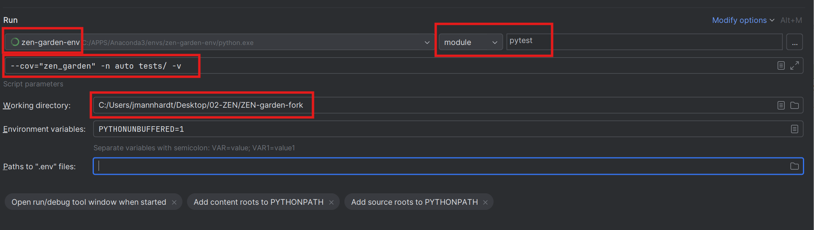
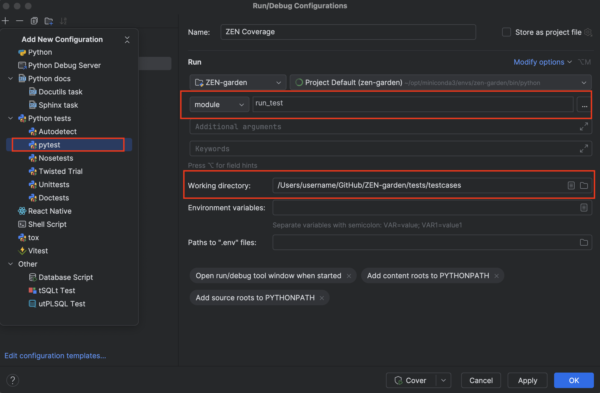

.. _contributing.contributing:

########################
Contribution Guide 
########################

We welcome any contribution to the ZEN-garden package. Many thanks for 
contributing to the project and helping to maintain our ZEN-garden!
This document provides guidelines on how to contribute to the project.
There are multiple ways to contribute:

* :ref:`Reporting bugs or suggesting new features <contributing.issues>`
* :ref:`Modifying the code <contributing.code>`
* :ref:`Improving the documentation <documentation.documentation>`
* :ref:`Writing tests <contributing.tests>`

.. _contributing.issues:

Reporting bugs or suggesting new features
=========================================

If you find a bug, have a feature request or want to suggest an improvement, 
please create an issue in the `GitHub repository 
<https://github.com/ZEN-universe/ZEN-garden/issues>`_.

When creating an issue, please follow these guidelines:

* The title should be short and descriptive.
* The description should contain all the necessary information to understand the 
  issue.
* If it is a bug, please provide a minimal working example that reproduces the 
  bug.
* Classify the issue according to the typology of issue (e.g. documentation, 
  enhancement, bug).

.. _contributing.code:

Editing Code in ZEN-garden 
==========================

GitHub Workflow
------------------

The following steps should be followed to contribute to ZEN-garden:

1. Fork and clone the repository, as described in the section on
   :ref:`installation for developers <dev_install.dev_install>`.

2. Familiarize yourself with ZEN-garden using the qick-start documentation 
   and the :ref:`tutorials <tutorials_intro.intro>`.

3. In your ZEN-garden fork, create a new branch for your feature:

   .. code::

       git checkout -b <feature_name>   

4. Make the desired code changes in this new branch.

5. Add documentation about your feature. See the :ref:`documentation 
   guide <documentation.documentation>` for instructions on how to 
   add documentation.

6. Test the code changes locally using the ZEN-garden tests. All tests must 
   pass.

7. Push your code changes to your personal ZEN-garden fork:

   .. code::

       git push --set-upstream <feature_name>    

8. Sign in to your online GitHub repository and go to your feature branch. You 
   should now see a button titled  ``Compare & pull request``. Click on this button 
   and follow the instructions to create a pull request.  

.. _contributing.coding_rules:

Coding rules
------------

We follow the `PEP-8 <https://peps.python.org/pep-0008/>`_ coding style:

* The name of the classes should always be with the first capital letter. The 
  classes must all have a well written docstring, as described in the :ref:`documentation 
  guide <documentation.docstring>`.

* The name of the methods should always be in lower case letters. The name can 
  be composed by multiple words, separated by underscores. The main methods
  should all have a proper docstrings, as described in the :ref:`documentation 
  guide <documentation.docstring>`.

* Comments are located above the line of code they refer to.

* All files contain a header which the information about the file, e.g., what 
  the class does.

* All variable names should lowercase. Variable names can be composed of
  multiple words, separated by underscores.

* The files name should always be lowercase. The file names can be composed 
  of multiple words, separated by underscores.

* The name of the folders should always be lowercase. The folder names can 
  be composed by multiple words, separated by underscores.

.. _contributing.branch_protections:

ZEN-garden Branch Protections
-----------------------------

The main branch of ZEN-garden is protected to prevent unauthorized 
changes to the model code. The following requirements must be 
in order to contribute code: 

1. All changes must be submitted through a pull-request.
   Direct pushes to the main branch of ZEN-garden are not allowed. Pull-requests
   can only be merged by ZEN-garden administrators.

2. The pull request must be up-to-date with the current main branch of 
   ZEN-garden before it is merged. If the feature is based on an older 
   version of ZEN-garden, it must be merged or rebased with the latest 
   version before the pull request is submitted.

3. Upon submission of a pull request, GitHub automatically runs the ZEN-garden
   tests (see :ref:`Github Actions <github_actions.github_actions>`). All defined 
   test cases must pass before the the new feature can be merged into the main
   branch of ZEN-garden. The status of these tests will appear in the pull
   request under the status check titled ``linux-64``.

.. _contributing.merge:

Merging Pull Requests (Administrators only)
-------------------------------------------

Once a pull request has been submitted, administrators can merge the pull 
request into the main branch of ZEN-garden. By the :ref:`branch protection 
rules <contributing.branch_protections>`, a merge is only possible if all the 
ZEN-garden tests have passed. 

Administrators may write a commit message to accompany the merge.
By default, the merge will be trigger a GitHub action which bumps the version 
of ZEN-garden by a patch and releases the new version to the Python Package 
Index. Administrators can alter this behavior by adding the following hash-tag 
codes anywhere in the merge commit message:

* ``#major`` - release a new major version of ZEN-garden. This should be done 
  when the pull request includes changes which make the code incompatible with
  older model versions (i.e, breaking changes).

* ``#minor`` - release a new minor version of ZEN-garden. This should be done
  when making large changes that maintain backward compatibility. Minor releases
  also trigger the ZEN-garden datasets (from ``.\docs\dataset_examples``) to be 
  re-uploaded to the Zenodo dataset repository. 

* ``#nobump`` - do not release a new version of ZEN-garden. This also prevents the
  merged changes from being released to PyPI  

.. _contributing.tests:

Running tests
=================

After implementing a new feature or fixing a bug, it is important to run the 
tests to ensure that the changes do not break the existing code. The tests are \
located in the ``tests`` folder and are written using the `pytest 
<https://docs.pytest.org/en/stable/>`_ framework. If you add new functionalities, 
make sure to add a new test that covers the new code.

You can execute the tests by running::

    pytest --cov="zen_garden" -n auto tests/ -v

**Pycharm configuration**

To run the tests, add another Python configuration. The important settings are:

- Change "script" to "module" and set it to "pytest"
- Set the "Parameters" to: ``--cov="zen_garden" -n auto tests/ -v``
- Set the python interpreter to the Conda environment that was used to install 
  the requirements and also has the package installed. **Important**: 
  This setup will only work for Conda environments that were also declared as 
  such in PyCharm; if you set the path to the Python executable yourself, you 
  should create a new proper PyCharm interpreter.
- Set the "Working directory" to the root directory of the repo.

In the end, your configuration to run the tests should look similar to this:

To run the test and also get the coverage report, we use the pipeline settings 
of the configuration. Add another Python configuration and use the following 
settings:

- Add a new configuration "Python tests/pytest"
- Change "script" to "module" and set it to "run_test"
- Set the python interpreter to the Conda environment that was used to install 
  the requirements and also has the package installed. **Important**: This setup 
  will only work for Conda environments that were also declared as such in 
  PyCharm; if you set the path to the Python executable yourself, you should 
  create a new proper PyCharm interpreter.
- Set the "Working directory" to the directory ``tests/testcases`` of the repo.

In the end, your configuration to run the coverage should look similar to this:

