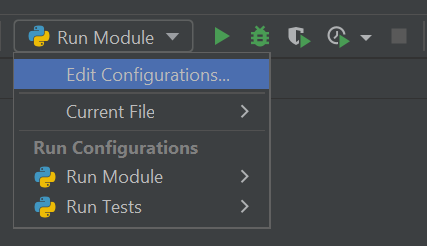
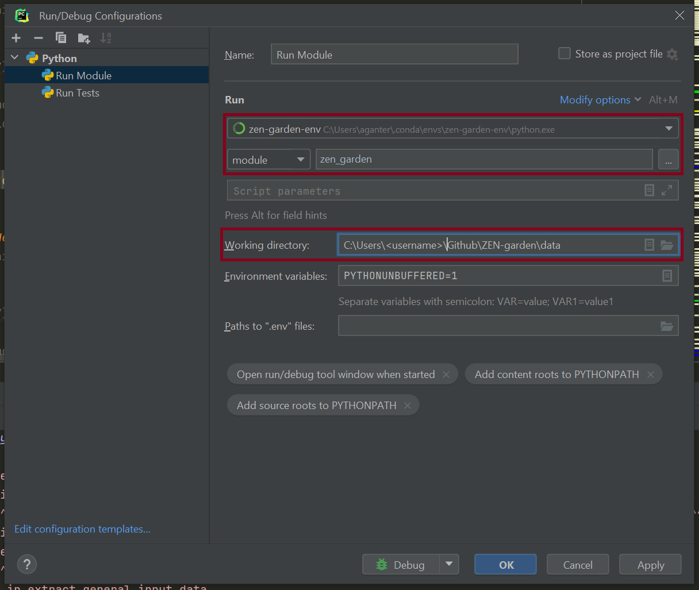
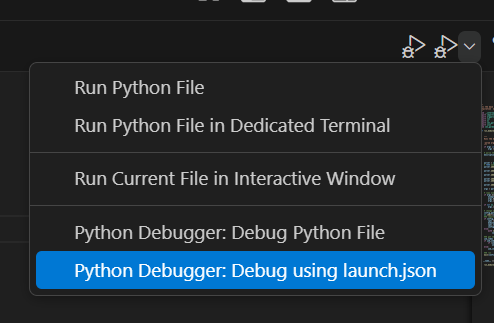

.. _debug.debug:

############################
Running and Debugging
############################

This section describes how to run and debug the ZEN-garden module for
developers. This section requires that the ZEN-Garden repository is forked as
described in :ref:`dev_install.dev_install`. When the repository is forked,
the code from the fork will be used to execute the module whenever ZEN-garden
is called on the command line or imported in a Python script.

This section assumes the user already has a model which they would like
to run and is familiar with the general instructions for :ref:`building a
model <building.building>` and :ref:`running a model <running.running>`.

# Run ZEN-garden as a Developer

For developers, we recommend using ``uv`` to run ZEN-garden. ``uv`` manages
the Python environment and dependencies for the project, ensuring that the
correct environment is used when running the model. Please follow the
:ref:`installation guide for developers <dev_install.dev_install>` to set up
the ``uv`` environment.

Once the ``uv`` environment is set up, ZEN-garden can be run as described in
the :ref:`running a model <running.run_model>` section. The only difference
is that command-line commands must be prepended with ``uv run``.

For example, instead of:

.. code-block:: console

    zen-garden <arguments>

use:

.. code-block:: console

    uv run zen-garden <arguments>

The ``uv run`` command automatically runs the command in the project's
environment.

.. tip::
    The command-line command ``zen-garden`` is a shortcut that invokes the
    ``run`` function from ``zen_garden``. This shortcut is
    defined in the ``[project.scripts]`` section of the ``pyproject.toml``.

Debugging ZEN-garden
====================

This section describes options for debugging ZEN-garden. Debugging is essential
for developing and testing the model codebase. Unfortunately, debugging
ZEN-garden is perhaps unintuitive at first. ZEN-garden is typically run from
the command line while debugging is usually done with an integrated development
environment (IDE) such as PyCharm or VS Code.

When debugging with an IDE, the IDE should use the Python interpreter from the
``uv`` environment created for the ZEN-garden project. The environment can be
located using:

.. code-block:: console

    uv run python -c "import sys; print(sys.executable)"

The resulting path can be configured as the Python interpreter in the IDE.

Debug ZEN-garden using a Python Script
--------------------------------------

The (perhaps easiest) way of debugging ZEN-garden is to write a Python script
from which to execute model runs. This method of running ZEN-garden is
described in detail in the :ref:`additional remarks section for
running model <running.additional_remarks>`. In short, ZEN-garden
can be run from a Python script using the following code:

.. code-block:: python

    from zen_garden import run
    import os

    os.chdir("<path/to/data>")
    run(dataset="<dataset_name>")

The script should be executed using the Python interpreter from the ``uv``
environment. For example:

.. code-block:: console

    uv run python <path/to/script.py>

Alternatively, the script can be configured as a run/debug configuration in
the IDE, with the Python interpreter set to the interpreter provided by
``uv``.

Using an IDE, this Python code can be run and debugged using the standard debug
functionalities of the IDE. Any breakpoints set within the ZEN-garden module
will be stopped at when the script is run in debug mode. As described in the
:ref:`additional remarks section for running model <running.additional_remarks>`,
all command-line flags for ZEN-garden can be
directly added to the ``run`` function of ZEN-garden.

.. _debug.IDE:

Debug using IDE-specific Configurations
---------------------------------------

Alternatively, developers may also debug ZEN-garden using IDE-specific debug
routines and configurations. These configurations are described below for two
common IDEs: PyCharm and VS Code.

In both cases, the IDE must use the Python interpreter from the ``uv``
environment. This ensures that the dependencies installed for ZEN-garden are
available when the debugger starts.

The interpreter path can be obtained with:

.. code-block:: console

    uv run python -c "import sys; print(sys.executable)"

The resulting path can then be selected as the Python interpreter in the IDE.

PyCharm configurations
^^^^^^^^^^^^^^^^^^^^^^

To set up easy running and debugging with the PyCharm IDE, use a Python run
configuration. This can be found next to the run button. Click on "Edit
Configurations..." to edit or add a configuration.

Add a new configuration by clicking on the "+" button on the top left corner of
the window. Choose ``Python`` as a type. You can name the configuration however
you like. The important settings are:

* Change "Script path" to "Module name" and set it to ``zen_garden``.
* Set the Python interpreter to the Python interpreter used by the ZEN-garden
  ``uv`` environment. The interpreter path can be obtained by running
  ``uv run python -c "import sys; print(sys.executable)"`` from the ZEN-garden
  repository.
* Set the "Working directory" to the path that contains the ``config.json``.
  This directory will also be used to save the results.

In the end, your configuration to run ZEN-garden as a module should look
similar to this:

Once these configurations are set, the standard ``run`` and ``debug`` buttons
of the PyCharm IDE can be used. When pressed, these buttons will create and
execute the appropriate commands for running and debugging ZEN-garden,
respectively. Command-line flags can be typed into the ``Parameters`` field of
the Run/Debug configuration.

.. note::
    PyCharm runs the configured Python interpreter directly. Therefore,
    ``uv run`` does not need to be added to the PyCharm configuration when the
    interpreter is already set to the Python executable from the ZEN-garden
    ``uv`` environment.

VS Code configurations
^^^^^^^^^^^^^^^^^^^^^^

To debug ZEN-garden with VS Code, first select the Python interpreter from the
ZEN-garden ``uv`` environment.

Press ``Ctrl + Shift + P`` to open the command palette (``Cmd + Shift + P`` on
macOS), select ``Python: Select Interpreter``, and choose the Python executable
used by the ZEN-garden ``uv`` environment.

The interpreter path can be obtained from the ZEN-garden repository with:

.. code-block:: console

    uv run python -c "import sys; print(sys.executable)"

Alternatively, create a ``.venv`` in the project using ``uv`` and select its
Python interpreter directly:

.. code-block:: console

    uv sync

The interpreter will then normally be located at ``.venv/bin/python``
on Linux and macOS, or ``.venv\Scripts\python.exe`` on Windows.

Create a new file in the folder ``./.vscode/`` called ``launch.json`` with the
following content:

.. code-block:: json

    {
        "version": "0.2.0",
        "configurations": [
            {
                "name": "Python: ZEN-Garden",
                "type": "debugpy",
                "cwd": "<path to folder with dataset>",
                "request": "launch",
                "module": "zen_garden",
                "console": "integratedTerminal"
            }
        ]
    }

The ``python`` executable selected in VS Code must be the one from the
project's ``uv`` environment. The ``launch.json`` configuration therefore
executes ``zen_garden`` directly with the same environment that is used by
``uv run``.

To debug ZEN-garden, select ``Python Debugger: Debug using launch.json`` from
the debug menu as shown in the figure. Note that no command-line flags can be
entered with this configuration. The dataset must therefore be specified in
the ``config.json`` file located in the dataset folder.

