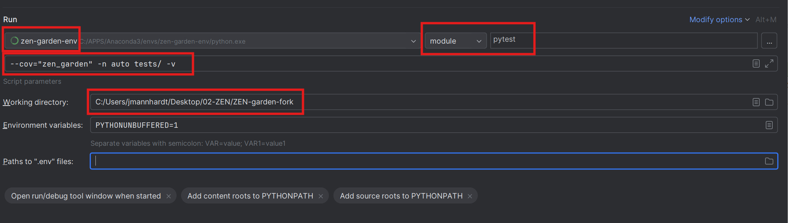
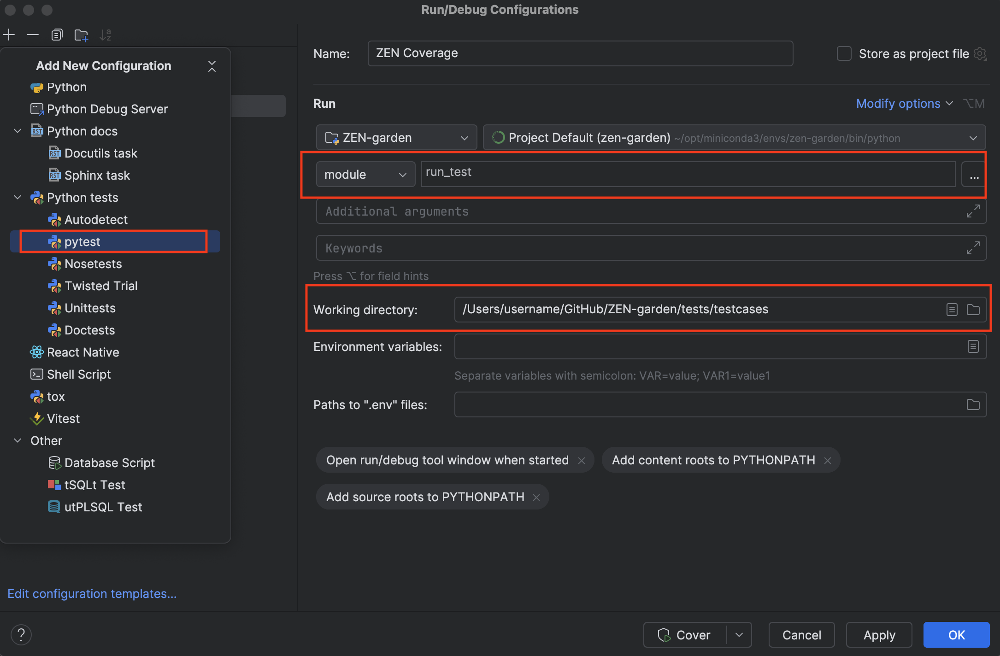

.. _testing.testing:

#######
Testing
#######

.. _testing.create:

Creating Tests
===============

1. Create new test model in ``test\testcases``. The model follows the same 
   format as any other ZEN-garden model and can be anything.
2. Check the test model for correctness and ensure that it has a unique solution.
3. Add variables on which to test to the file ``test\testcases\test_variables.json``.
4. Add test case function to ``test\testcases\runtest.py``.
5. Add the test-case description to ``tests\testcases\docu_test_cases.md``.

.. _testing.run:

Running tests
=================

After implementing a new feature or fixing a bug, it is important to run the 
tests to ensure that the changes do not break the existing code. The tests are \
located in the ``tests`` folder and are written using the `pytest 
<https://docs.pytest.org/en/stable/>`_ framework. If you add new functionalities, 
make sure to add a new test that covers the new code.

You can execute the tests by running::

    pytest --cov="zen_garden" -n auto tests/ -v

**Pycharm configuration**

To run the tests, add another Python configuration. The important settings are:

- Change "script" to "module" and set it to "pytest"
- Set the "Parameters" to: ``--cov="zen_garden" -n auto tests/ -v``
- Set the python interpreter to the Conda environment that was used to install 
  the requirements and also has the package installed. **Important**: 
  This setup will only work for Conda environments that were also declared as 
  such in PyCharm; if you set the path to the Python executable yourself, you 
  should create a new proper PyCharm interpreter.
- Set the "Working directory" to the root directory of the repo.

In the end, your configuration to run the tests should look similar to this:

To run the test and also get the coverage report, we use the pipeline settings 
of the configuration. Add another Python configuration and use the following 
settings:

- Add a new configuration "Python tests/pytest"
- Change "script" to "module" and set it to "run_test"
- Set the python interpreter to the Conda environment that was used to install 
  the requirements and also has the package installed. **Important**: This setup 
  will only work for Conda environments that were also declared as such in 
  PyCharm; if you set the path to the Python executable yourself, you should 
  create a new proper PyCharm interpreter.
- Set the "Working directory" to the directory ``tests/testcases`` of the repo.

In the end, your configuration to run the coverage should look similar to this:

