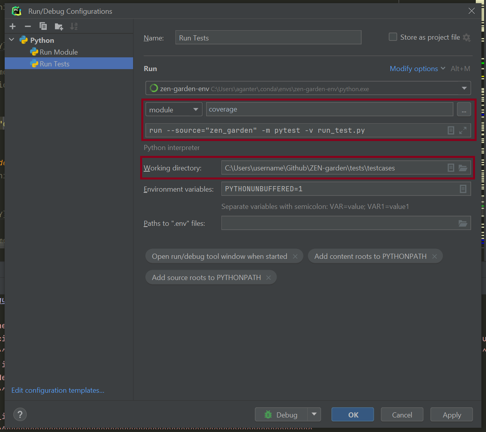

################
Running a model
################

Running ZEN-garden from Anaconda prompt
==============

To run ZEN-garden from your Anaconda prompt fist, activate the environment where you installed ZEN-garden. Per default, the environment will be called ``zen-garden-env``::

  conda activate zen-garden env

Make sure to change your path to the working directory, i.e. the directory that contains the ``config.json``. This directory will also be used to save the results::

  cd Users/username/Github/ZEN-garden/data

Execute the following lines to run ZEN-garden as a module::

  Python -m zen_garden

You can change the dataset selected in ``config.py`` via the dataset argument::

  Python -m zen_garden --dataset=<my_dataset>

You can also execute the tests by running::

  coverage run --source="zen_garden" -m pytest -v tests/testcases/run_test.py

The coverage report is also generated in a similar way by running::

  coverage report -m

PyCharm configurations
==============

To execute ZEN-garden with the PyCharm IDE you can use the configuration setup which can be found next to the run button, and click on "Edit configurations.." to edit or add a configuration. There are three configurations that are easy to setup and run the model, the tests, and get the coverage reports.

.. image:: ../images/pycharm_configuration.png
    :alt: creating zen-garden configurations in pycharm

**Running the module**

Add a new configuration by clicking on the "+" button on the top left corner of the window. Choose ´´Python´´ as a type. You can name the configuration however you like. The important settings are:

- Change "Script Path" to "Module name" and set it to "zen_garden"
- Set the Python interpreter to the Conda environment that was used to install the requirements and ZEN-garden as a package. Per default, the environment will be named "zen-garden-env". **Important**: This setup will only work for Conda environments that were also declared as such in PyCharm; if you set the path to the Python executable, you will have to create a new PyCharm interpreter first.
- Set the "Working directory" to the path that contains the ``config.json``. This directory will also be used to save the results.

In the end, your configuration to run ZEN-garden as a module should look similar to this:

.. image:: ../images/pycharm_run_module.png
    :alt: run module

**Running the tests**

To run the tests, add another Python configuration. The important settings are:

- Change "Script Path" to "Module name" and set it to "coverage"
- Set the "Parameters" to: ``´run --source="zen_garden" -m pytest -v run_test.py``
- Set the python interpreter to the Conda environment that was used to install the requirements and also has the package installed. **Important**: This setup will only work for Conda environments that were also declared as such in PyCharm; if you set the path to the Python executable yourself, you should create a new proper PyCharm interpreter.
- Set the "Working directory" to the directory ``tests/testcases`` of the repo.

In the end, your configuration to run the tests should look similar to this:

**Getting the coverage report**

To run the test and also get the coverage report, we use the pipeline settings of the configuration. Add another Python configuration and use the following settings:

- Change "Script Path" to "Module name" and set it to "coverage"
- Set the "Parameters" to ``report -m``
- Set the python interpreter to the Conda environment that was used to install the requirements and also has the package installed. *Important*: This setup will only work for Conda environments that were also declared as such in PyCharm; if you set the path to the Python executable yourself, you should create a new proper PyCharm interpreter.
- Set the "Working directory" to the base directory of the repo.
- Click on "Modify options", go to the section "Before launch", and select "Add run before launch" where you can now add the "Run Tests" configuration from above.

In the end, your configuration to run the coverage should look similar to this:

.. image:: ../images/pycharm_coverage.png
    :alt: run coverage

VS code configuations
==============

To run ZEN-garden as a module in VS code follow these steps:

- select the correct interpreter: Press ctrl + shift + p to open the command palette (if you're on Windows or Linux), and enter ``Python: Select interpreter`` and make sure that the correct conda environment is selected. Per default, the conda enivronment will be called ``zen-garden-env``.
- Create a new file in the folder ``./.vscode/`` called ``launch.json`` with the following content:

.. code-block:: JSON

  {"configurations": [
      {
        "name": "Python: ZEN-Garden", 
        "type": "python", 
        "cwd":"<path to folder with config.py>", 
        "request": "launch", "module": "zen_garden", 
        "console": "integratedTerminal"
      }
    ]
  }

