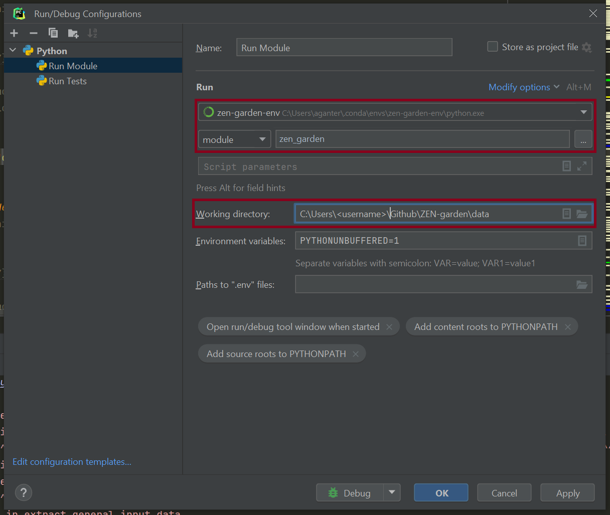

.. _running_a_model:
.. _Running a model:
################
Running a model
################

Running ZEN-garden from a terminal
==============

Activate the environment
------------------------

To run ZEN-garden from a terminal, activate the environment where you installed ZEN-garden. If you downloaded ZEN-garden from pip (``pip install zen-garden``, :ref:`For users`), activate the environment where you installed ZEN-garden.

.. code-block::

    conda activate <your_environment>

If you installed ZEN-garden from the repository and created a new environment (:ref:`For developers`), per default, the environment will be called ``zen-garden``::

  conda activate zen-garden

.. _Run example:
Run ZEN-garden with an example dataset
--------------------------------------

To run ZEN-garden with an example dataset (see `Dataset Examples <dataset_examples.rst>`_), execute the following line::

  python -m zen_garden --example=<example_name>

This command is particularly useful when you installed ZEN-garden from pip and do not have the repository on your local machine.

.. note::
    Dataset examples are an easy and quick way to get started with your model.
    Find an example that best suits your need and use it as a template to build your own model.

The example dataset and the ``config.json`` file will be downloaded, a new folder will be created in the working directory, and the optimization will be run. No prior setup is needed.

The optimization results will be stored in ``dataset_examples/outputs``. A Jupyter notebook will be downloaded to give you fast access to your results (see more at `Analyzing a model <analyzing_models.rst>`_).

.. _Run ZEN-garden with preexisting datasets:
Run ZEN-garden with preexisting datasets
----------------------------------------
If you already have a model that you want to run, change your path to the working directory, i.e. the directory that contains the ``config.json``. This directory will also be used to save the results::

  cd /path/to/your/data

.. note::
    You can create the data folder in the ZEN-garden root folder, but it will not be uploaded to Github (it is in the ``.gitignore`` file).
    This way, you can keep your data separate from the repository. **However, we recommend keeping the data folder in a different location than the ZEN-garden source code.**

Execute the following lines to run ZEN-garden::

  python -m zen_garden

When running the previous line, ZEN-garden will attempt to run the dataset specified in ``analysis/dataset`` in ``config.json``. You can change the dataset via the dataset argument::

  python -m zen_garden --dataset=<my_dataset>

If you have multiple ``config.json`` files in your working directory, you can specify the file you want to use with the ``config`` argument::

  python -m zen_garden --config=<my_config.json> --dataset=<my_dataset>

PyCharm configurations (only for ZEN-garden fork)
=======

To execute ZEN-garden with the PyCharm IDE you can use the configuration setup which can be found next to the run button, and click on "Edit configurations.." to edit or add a configuration.

.. image:: ../images/pycharm_configuration.png
    :alt: creating zen-garden configurations in pycharm

Add a new configuration by clicking on the "+" button on the top left corner of the window. Choose ´´Python´´ as a type. You can name the configuration however you like. The important settings are:

- Change "Script Path" to "Module name" and set it to "zen_garden"
- Set the Python interpreter to the Conda environment that was used to install the requirements and ZEN-garden as a package. Per default, the environment will be called ``zen-garden``. **Important**: This setup will only work for Conda environments that were also declared as such in PyCharm; if you set the path to the Python executable, you will have to create a new PyCharm interpreter first.
- Set the "Working directory" to the path that contains the ``config.json``. This directory will also be used to save the results.

In the end, your configuration to run ZEN-garden as a module should look similar to this:

VS code configuations (only for ZEN-garden fork)
==============

To run ZEN-garden as a module in VS code follow these steps:

- select the correct interpreter: Press ctrl + shift + p to open the command palette (if you're on Windows or Linux), and enter ``Python: Select interpreter`` and make sure that the correct conda environment is selected. Per default, the conda enivronment will be called ``zen-garden``.
- Create a new file in the folder ``./.vscode/`` called ``launch.json`` with the following content:

.. code-block:: JSON

  {"configurations": [
      {
        "name": "Python: ZEN-Garden", 
        "type": "python", 
        "cwd":"<path to folder with config.py>", 
        "request": "launch", "module": "zen_garden", 
        "console": "integratedTerminal"
      }
    ]
  }

