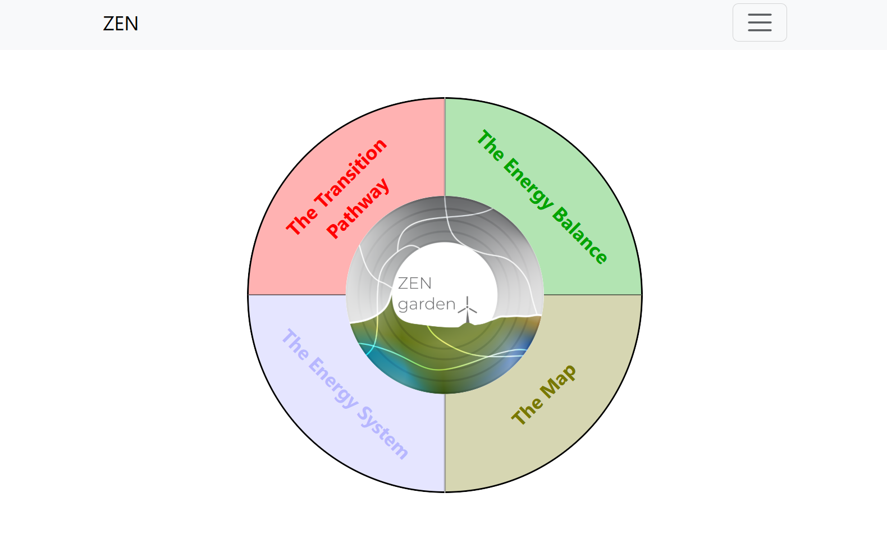
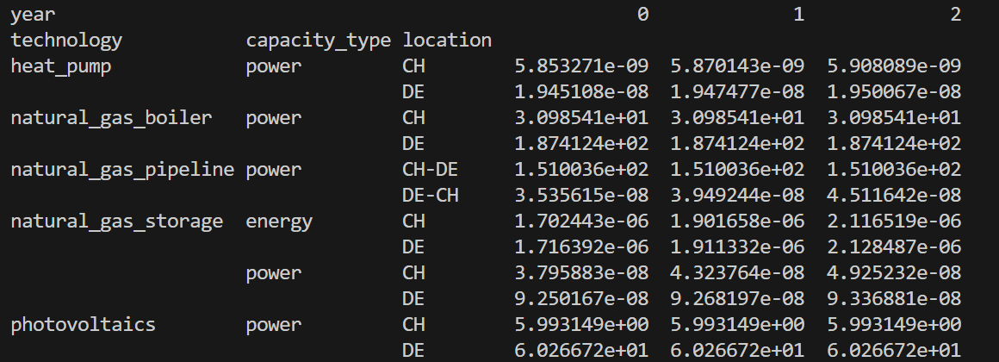

.. _t_analyze.t_analyze:

###########################
Tutorial 1: Analyze Outputs
###########################

This tutorial describes how to analyze the the outputs of the ZEN-garden model.
Two approaches are introduced:

1. The ZEN-garden visualization platform
2. The ZEN-garden ``Results`` codebase.

The visualization platform is an ideal starting point for data analysis.
The platform allows user to see standardized plots of capacity mixes, 
generation mixes, energy balances, technology locations. The platform is 
interactive, allowing users to select what regions, time-steps, and scenarios,
and energy carriers to view results from. In contrast, the results codebase 
is ideal for detailed analyses where users work directly with the model output 
and produce custom plots or calculations. The codebase allows users to easily 
filter, extract, and compare results from various scenarios. 

This tutorial assumes that you have installed and run the example dataset 
``5_multiple_time_steps_per_year`` as described in the tutorial :ref:`setup 
instructions <tutorials_intro.setup>`. It also assumes that the ZEN-garden conda 
environment is already activated (:ref:`see instructions 
<installation.activate>`). The raw results of each ZEN-garden simulation are 
stored in the following path relative to the ``data`` folder: 
``data\output\<dataset_name>``. 

.. tip::
    The results are self-contained, i.e., you can copy the ``<dataset_name>`` 
    folder to another location and still access the results.

.. _t_analyze.visualization:

Visualization Platform
======================

Running the Platform
--------------------

Use the following steps to run the visualization platform:

1. In a terminal window, navigate to the ``data`` folder which contains the input
   data for the example model and the newly generated ``output`` folder.

   .. code:: text

        cd /path/to/your/data

2. Activate the ZEN-garden environment in case it is not already activated 
   (see :ref:`instructions <installation.activate>`). Then, run the following 
   command:

   .. code::

        python -m zen_garden.visualization

   Running this command will pull up a new tab in your default browser 
   containing the visualization platform. If the tab does not open automatically, 
   you can open http://localhost:8000/ in any browser of your choice.

.. tip::
    To exit the visualization tool, press Control + C in the terminal window. 

.. note::

    By default, the suite looks for solutions that are contained in the folder 
    ``./outputs``, relatively to where you run the command. If you are copying 
    results from somewhere else, make sure to create a folder called ``outputs`` 
    and copy the results there. Alternatively, you can pass an arbitrary folder 
    with ``python -m zen_garden.visualization -o <path to your solutions 
    folder>`` to change the solutions folder.

The main menu of the visualization platform shows three options:

1. **The Transition Pathway** - contains plots which show how key system
   variables, namely capacity, production, emissions, and costs, change annually 
   between different simulation years.

2. **The Energy Balance** - contains plots showing nodal energy and storage
   balances throughout all time-steps within a single year.

3. **The Map** - allows users to see a map of how generation is distributed 
   among regions in the model. Each map shows annual results for one carrier and 
   one simulation year.

    
    Homepage of the ZEN-garden visualization platform. 

Example Exercises
-----------------

1. **Use the ZEN-Garden visualization platform to identify the total the total 
   capacity of natural gas boilers in 2023 in (a) Germany, (b) Switzerland,
   and (c) total.**

   To answer this question, select the following options on the visualization 
   tool: 

   a. Click on "The Transition Pathway."
   b. Click on "Capacity."
   c. Select the following options when asked: `Solution` = 
      ``5_multiple_time_steps_per_year``, `Variable` = ``capacity``, `Technology 
      Type` = ``conversion``, `Carrier` = ``heat``. These options tell the 
      visualization platform to look at all conversion technology capacities in 
      the output ``5_multiple_time_steps_per_year`` for technologies which 
      either produce or consume heat.
   d. You can now hover your cursor over the shown diagram to identify the 
      total capacity of natural gas boilers installed in the model. To get
      capacities for individual countries, you can select which countries you
      would like to look at in the menu called ``Node``.

   `Solution: CH = 31 GW, DE = 187 GW, Total = 218 GW`

2. **For Germany in 2023, what hour of the simulation has the highest electricity 
   demand?**
   
   To answer this question, select the following options on the visualization 
   tool:

   a. Click on "The Energy Balance".
   b. Click "Nodal Energy Balance".
   c. Select the following options when asked: `Solution` = 
      ``5_multiple_time_steps_per_year``, `Year` = ``2023``, 
      `Node` = ``Germany``, `Carrier` = ``electricity``. These options tell
      the visualization platform to display an hourly electricity balance for
      Germany in 2023.
   d. You can now hover your cursor over the hour which has the highest 
      electricity demand. A pop-up bubble should then show the hour
      during which that demand value occurred and the demand value at that 
      time.

   `Solution: Hour Number = 89, Demand = 60.267 GW`

.. tip::
    You can investigate precomputed results from past studies with the 
    visualization suite by visiting the following link: 
    https://zen-garden.ethz.ch/. These studies contain much richer outputs
    than the example. They are thus ideal for exploring the platform's full 
    visualization potential. 

.. _t_analyze.results_code:

Results Codebase
=================

Detailed ZEN-garden results are stored in the ``output`` folder of the ``data`` 
directory. ZEN-garden provides functions and tools for easily loading,
extraction, processing, and aggregation of outputs. This tutorial describes
how to use the most basic functions from ZEN-garden results processing. All
code chunks in this section refer to Python code. 

The easiest way to access the results values is to import raw data into an 
object of the the ``Results`` class from the ``zen_garden`` package. To do this,
open a python editor (e.g. Pycharm, VSCode or Jupyter Notebook) and activate
the ZEN-garden environment. Then, load the results with the following code:

.. code:: python

    from zen_garden.postprocess.results.results import Results
    r = Results(path='<result_folder>')

The path ``<result_folder>`` is the path to the results folder of the dataset, 
e.g., ``<data>/output/<dataset_name>``. 

The results class has many methods (i.e. functions) which can be used to access
subsets of the results. The sections below describe some of the must important
methods and how they can be used. 

Read variables and parameters
-----------------------------

The result codebase allows users to easily access all (1) sets of technologies 
and nodes; (2) parameters of the original model ; (3) primal variable optimal 
values; and (4) and dual variable optimal values. In the results code these four
elements are collectively referred to as ``components``.

Step 1: Identify the name of the component
^^^^^^^^^^^^^^^^^^^^^^^^^^^^^^^^^^^^^^^^^^

All components are stored in a dictionary ``r.solution_loader.components``. A 
complete list of all parameter, variable, and dual variable names can therefore
be obtained using the command:

.. code:: python

    r.solution_loader.components.keys()

.. tip::
    Any component whose name starts with ``constraint_`` refers to a dual
    variable. Dual variables are not saved to the results by default. To view
    dual variables, users therefore need to adjust the ZEN-garden 
    configurations, as described in :ref:`configurations tutorial 
    <t_configuration.t_configuration>` 

To filter the names by component type (``<component_type>`` in {``'parameter'``, 
``'variable'``, ``'dual'``, ``'sets'``})  the following member function can be 
used:

.. code:: python

    r.get_component_names(<component_type>)

For example, the following code produces a list of all variable names used 
in the model: 

.. code:: python

    r.get_component_names('variable')

From the list of components names, select the component which your are interested
in investigating. Descriptions of all components can be found in the in the 
documentation on :ref:`sets, parameters, variables, and constraints 
<notation.notation>`.

Step II: Read component values
^^^^^^^^^^^^^^^^^^^^^^^^^^^^^^

Once you have identified the name of the component you would like to 
investigate, several methods enable easy access to the component values. These 
are:

1. ``r.get_full_ts(<component_name>)``: Returns the full time series values of 
   the component. In case of hourly-resolved data, the time series has a length 
   of 8760 times the number of years simulated.
2. ``r.get_total(<component_name>)``: Returns annual total values of the
   component. For components which are resolved hourly, all values within the
   same year are summed together.
3. ``r.get_dual(<component_name>)``: Returns the dual values of the constraints.
4. ``r.get_unit(<component_name>)``: Returns the units of the component.
5. ``r.get_doc(<component_name>)``: Returns the documentation string of the component.

To access the annual capacity values of all technologies, for example, you can
use the following code:

.. code:: python

    r.get_total('capacity')
    
This code returns a pandas multi-index DataFrame showing the capacity of all 
technologies in all years and all regions (see :ref:` image below 
<t_analyze.fig.capacity_results`>). 

.. _t_analyze.fig.capacity_results:

    
    Output of ``r.get_total('capacity')``. 

Step III: Filter component values
^^^^^^^^^^^^^^^^^^^^^^^^^^^^^^^^^

The above functions (``get_full_ts``, ``get_total``, ``get_dual``, ``get_unit``,
and ``get_doc``) each allow optional input arguments for further narrowing the
results to values from a single scenario, year, or region. The optional input 
arguments for these functions are:

1. ``year``: A single optimization period for which the results should be 
   returned (0, 1, 2, ...). Noe that this is not available for ``r.get_unit()``.
2. ``scenario_name``: A single scenario name for which the results should be 
   returned. This is only relevant when using the scenario tool, as described
   in the :ref:`scenarios tutorial <t_scenario.t_scenario>`.
3. ``index``: A slicing index for the results, i.e., a list of indices that 
   of the dataframe for which results should be returned. 

There are four ways to pass an index:

1. A single index, e.g., ``r.get_total('capacity', index="heat_pump")``. This 
   returns the capacity of heat pump for all other indices (e.g., nodes and 
   years). Importantly, the index must correspond to the first index of the 
   component.
2. A list of indices, e.g., ``r.get_total('capacity', index=["heat_pump", 
   "photovoltaics"])``. This returns the capacity of heat pump and photovoltaics 
   for all other indices. Importantly, the index must correspond to the first 
   index of the component.
3. A tuple of indices, e.g., ``r.get_total('capacity', index=("heat_pump", None, 
   ["DE","CH"]))``. This returns the capacity of heat pump in the nodes DE and 
   CH. The order of index levels matters. The value of a key can either be a 
   single index, None, or a list of indices. In case of None, all indices of 
   the corresponding level are returned.
4. A dictionary, e.g., ``r.get_total('capacity', index={"node": ["DE", "CH"], 
   "technology": "heat_pump"})``. This returns the capacity of heat pump in the 
   nodes DE and CH. The value of a key can either be a single index or a list 
   of indices. The dictionary must contain the keys of the component. Since the 
   key is passed, the order of the keys does not matter.

.. note::
    The result class can only identify the components present in the result 
    files. Please refer to :ref:`configuration.solver` on how to only save 
    selected parameters and variables. If the user wants to access a component 
    that was not saved, the user must add the component to the 
    ``selected_saved_parameters`` or ``selected_saved_variables`` in the 
    solver settings.

Example Exercises
^^^^^^^^^^^^^^^^^

1. **Use the ZEN-Garden results code to identify the total the total 
   capacity of natural gas boilers in 2023 in (a) Germany, (b) Switzerland,
   and (c) total to meet the heat demand.**

   To answer this question, the following code can be used:

   .. code:: python

    from zen_garden.postprocess.results.results import Results
    r = Results(path='<result_folder>')
    capacity_CH = r.get_total('capacity', index=("natural_gas_boiler", None, "CH"), year = 0).iloc[0,0]
    capacity_DE = r.get_total('capacity', index=("natural_gas_boiler", None, "CH"), year = 0).iloc[0,0]
    print(f"German Capacity: {capacity_DE}")
    print(f"Swiss Capacity: {capacity_CH}")
    print(f"Total Capacity: {capacity_DE + capacity_CH}")

   `Solution: CH = 31 GW, DE = 187 GW, Total = 218 GW`

2. **For Germany in 2023, what hour of the simulation has the highest 
   electricity demand?**

   To answer this question, the following code can be used: 

   .. code:: python
    
    from zen_garden.postprocess.results.results import Results
    import numpy as np
    r = Results(path='<result_folder>')
    demand_DE = r.get_full_ts('demand', index=("electricity", "CH"), year=0)
    hour = np.argmax(demand_DE)
    max_demand = np.max(demand_DE)
    print(f"Hour Number: {hour}")
    print(f"Demand: {max_demand}")

   `Solution: Hour Number = 89, Demand = 60.267 GW`

.. _t_analyze.compare:

Comparing results
-----------------

ZEN-garden provides methods to compare two different result objects. This can be 
helpful to understand why two results differ. Furthermore, it allows for a fast 
way to spot errors in the datasets. The most useful application is to compare 
the configuration (:ref:`configuration.configuration`) of two datasets and the 
parameter values. Comparing variable values is often not very informative, as 
the results mostly differ in a large variety of variables.

Let's assume you have the following two result objects:

.. code:: python

    from zen_garden.postprocess.results.results import Results
    r1 = Results(path='<result_folder_1>')
    r2 = Results(path='<result_folder_2>')

Then you can compare the two result objects with the following code:

.. code:: python

    from zen_garden.postprocess.comparisons import compare_model_values, compare_configs
    compare_parameters = compare_model_values([r1, r2], component_type = 'parameter')
    compare_variables = compare_model_values([r1, r2], component_type = 'variable')
    compare_config = compare_configs([r1, r2])

Per default, ``compare_model_values`` compares the total annual values of 
components (:ref:`t_analyze.results_code`). If the user wants to compare the 
full time series, the optional argument ``compare_total=False`` can be passed 
to the function. ``compare_model_values`` also accepts ``component_type = 
"dual"`` and ``component_type = "sets"``. ``compare_configs`` compares the 
configurations of the two datasets.
