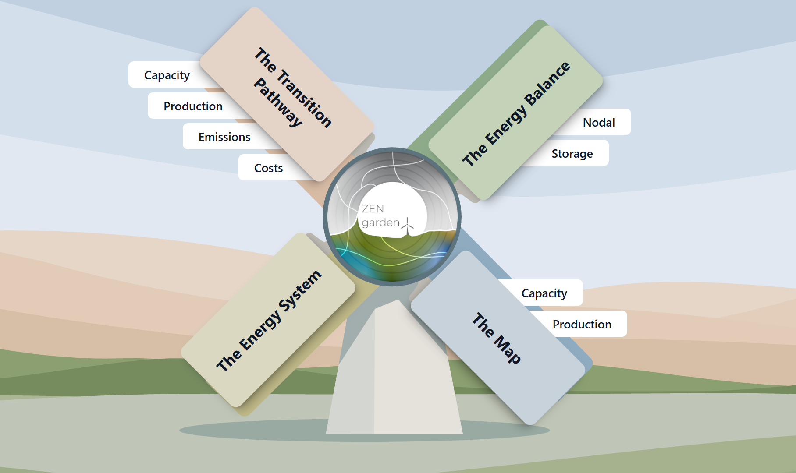

.. _t_analyze.t_analyze:

############################
Analyze and compare results
############################

.. admonition:: At a glance
   :class: note

   | **You will** read model results with the ZEN-temple visualization platform and with the
        ``Results`` class, and compare two runs against each other.
   | **You need** the setup from :ref:`tutorials_intro.setup`.

ZEN-garden offers two ways to look at results.

The **ZEN-temple visualization platform** is the place to start. It shows standardized,
interactive plots of capacity mixes, generation mixes, energy balances and
technology locations, and lets you focus on specific regions, time steps, scenarios and
carriers.

The **Results class** is for detailed analysis: working directly with the model
output to produce custom plots or calculations, and filtering, extracting and
comparing results across scenarios.

The raw results of each ZEN-garden simulation are 
stored in the following path relative to the ``data`` folder: 
``data\output\<dataset_name>``. 
Results are written to ``<data>/outputs/<dataset_name>``.

.. _t_analyze.visualization:

Visualization platform
======================

Running the platform
--------------------

1. In a terminal, navigate to the ``<data>`` folder that contains your
   ``outputs`` folder:

   .. code-block:: shell

        cd <data>

2. Activate the environment if it is not already active (see
   :ref:`instructions <installation.activate>`). The visualization platform is
   provided by the separately installable ZEN-temple package; install it with
   ``pip install zen-temple`` if it is not already installed. Then run:

   .. code-block:: shell

        zen-visualization

   A new tab opens in your default browser. If it does not open automatically,
   go to http://localhost:8000/.

.. tip::
    To stop the visualization tool, press ``Ctrl + C`` in the terminal.

.. note::

    By default the platform looks for solutions in the ``./outputs`` folder,
    relative to where you ran the command. If you copied results from
    somewhere else, either place them in a folder called ``outputs``, or pass
    the folder explicitly with
    ``zen-visualization -o <path to your solutions folder>``.

The main menu shows four options
(:numref:`t_analyze.fig_viz_homepage`):

1. **The Transition Pathway**: How key system variables (capacity,
   production, emissions, costs) change between simulation years. Annual values
   only.

2. **The Energy Balance**: Nodal energy and storage balances across all time
   steps within a single year. Dual values of the nodal energy balance
   constraint are also shown, if they were saved
   (see :ref:`t_output.t_output`).

3. **The Energy System**: A flow chart of carriers and technologies. The width
   of each carrier indicates how much of it is used in the optimal solution.
   Each chart covers a single year. Unused carriers and technologies are
   omitted.

4. **The Map**: How generation and capacity is distributed across regions, 
   for one carrier and one year at a time.

.. _t_analyze.fig_viz_homepage:

    Homepage of the visualization platform.

Exercises
---------

1. **What is the total capacity of natural gas boilers in 2023 in (a) Germany,
   (b) Switzerland, and (c) in total?**

   a. Click "The Transition Pathway".
   b. Click "Capacity".
   c. Select `Solution` = ``4_multiple_time_steps_per_year``,
      `Variable` = ``capacity``, `Technology Type` = ``conversion``,
      `Carrier` = ``heat``. This shows all conversion technology capacities
      for technologies that produce or consume heat.
   d. Hover over the diagram to read the installed capacity. To get capacities
      for individual countries, select them under ``Node``.

   *Solution: CH = 31 GW, DE = 187 GW, total = 218 GW.*

2. **For Germany in 2023, which hour has the highest electricity demand?**

   a. Click "The Energy Balance", then "Nodal Energy Balance".
   b. Select `Solution` = ``4_multiple_time_steps_per_year``,
      `Year` = ``2023``, `Node` = ``Germany``, `Carrier` = ``electricity``.
   c. Hover over the peak to read the hour and the demand value.

   *Solution: hour 89, demand = 60.267 GW.*

.. tip::
    You can explore precomputed results from past studies at
    https://zen-garden.ethz.ch/explorer. Those studies have much richer outputs than
    this example and are better for exploring the platform.

.. _t_analyze.results_code:

The Results class
=================

Open a Python editor (PyCharm, VS Code, a Jupyter notebook) with the ZEN-garden
environment active, and load the results:

.. code:: python

    from zen_garden import Results
    r = Results(path='<data>/outputs/4_multiple_time_steps_per_year')

The ``Results`` class exposes the sets of technologies and nodes, the model
parameters, the optimal values of the primal variables, and the dual variables.
Collectively these are called *components*.

Step 1: find the component name
-------------------------------

List the names of one component type, one of ``'parameter'``, ``'variable'``,
``'dual'`` or ``'sets'``:

.. code:: python

    r.get_component_names('variable')

Descriptions of all components are in :ref:`notation.notation`.

.. tip::
    Any component whose name starts with ``constraint_`` is a dual variable.
    Duals are not saved by default; see :ref:`t_output.t_output` to enable
    them.

Step 2: read the values
-----------------------

.. code:: python

    r.get_total('capacity')

``get_total`` returns annual totals; ``get_full_ts`` returns the full time
series. Both return a pandas multi-index DataFrame
(:numref:`t_analyze.fig.capacity_results`).

.. _t_analyze.fig.capacity_results:

.. figure:: ../figures/tutorials/capacity_results.png
    :figwidth: 550 pt
    :align: center

    Output of ``r.get_total('capacity')``.

Step 3: filter the values
-------------------------

All readers accept ``year``, ``scenario_name`` and ``index`` arguments. For
example, to get the heat pump capacity in DE and CH only:

.. code:: python

    r.get_total('capacity', index={"technology": "heat_pump", "location": ["DE", "CH"]})

There are four ways to pass an index, and further arguments for units and
scenarios. These are documented in full in :ref:`results_api.results_api`.

Step 4: read dual variables
----------------------------

Dual variables are not saved by default; see :ref:`t_output.t_output` to
enable them. Once saved, read them the same way as any other component, with
``get_dual`` instead of ``get_total`` or ``get_full_ts``:

.. code:: python

    r.get_dual(
        'constraint_nodal_energy_balance',
        index={"carrier": "electricity", "node": "DE"},
        year=2023,
    )

``constraint_nodal_energy_balance`` is the marginal price of a carrier at a
node and time step: how much the objective would change if demand there rose
by one unit. It is the dual most people enable duals for.

.. tip::
    ``r.get_component_names('dual')`` lists every dual saved in a run. Every
    dual's name is the name of its constraint.

Exercises
---------

1. **What is the total capacity of natural gas boilers in 2023 in (a) Germany,
   (b) Switzerland, and (c) in total?**

   .. code:: python

    from zen_garden import Results
    r = Results(path='<data>/outputs/4_multiple_time_steps_per_year')
    capacity_CH = r.get_total('capacity', index=("natural_gas_boiler", None, "CH"), year=0).iloc[0, 0]
    capacity_DE = r.get_total('capacity', index=("natural_gas_boiler", None, "DE"), year=0).iloc[0, 0]
    print(f"Swiss capacity:  {capacity_CH}")
    print(f"German capacity: {capacity_DE}")
    print(f"Total capacity:  {capacity_CH + capacity_DE}")

   *Solution: CH = 31 GW, DE = 187 GW, total = 218 GW, the same numbers you
   read off the visualization platform above.*

2. **For Germany in 2023, which hour has the highest electricity demand?**

   .. code:: python

    from zen_garden import Results
    import numpy as np
    r = Results(path='<data>/outputs/4_multiple_time_steps_per_year')
    demand_DE = r.get_full_ts('demand', index=("electricity", "DE"), year=0)
    print(f"Hour number: {np.argmax(demand_DE)}")
    print(f"Demand:      {np.max(demand_DE)}")

   *Solution: hour 89, demand = 60.267 GW.*

   Note the index ``("electricity", "DE")``: the first index level of
   ``demand`` is the carrier and the second is the node. Swapping in ``"CH"``
   answers the same question for Switzerland.

3. **What is the marginal price of electricity in Germany at that same hour?**
   Re-run the dataset with ``save_duals: true`` in ``config.yaml`` (see
   :ref:`t_configuration.t_configuration`), then:

   .. code:: python

    from zen_garden import Results
    r = Results(path='<data>/outputs/4_multiple_time_steps_per_year')
    dual = r.get_dual(
        'constraint_nodal_energy_balance',
        index={"carrier": "electricity", "node": "DE"},
        year=2023,
    )
    print(dual.iloc[0, 89])

   *Solution: 0.656. The marginal price of electricity peaks at the same
   hour as demand.*

.. _t_analyze.sectoral:

Sectoral costs and emissions
=============================

``get_sectoral_costs`` and ``get_sectoral_emissions`` attribute total system
costs and emissions to the sectors that consume them, following the energy
system from final demand back through every conversion, transport and storage
technology involved in supplying it.

.. code:: python

    from zen_garden import Results
    r = Results(path='<data>/outputs/4_multiple_time_steps_per_year')
    total_costs, direct_costs = r.get_sectoral_costs()
    total_emissions, direct_emissions = r.get_sectoral_emissions()

Both return a pair of DataFrames, indexed by sector, the technology or carrier
the cost or emission stems from, and a cost or emission type:

* **Total** includes everything embodied upstream. The heat sector's total
  cost includes the capex and opex of the boiler that produces the heat and
  the fuel it burns, even though the fuel itself is booked to natural gas, not
  to heat.
* **Direct** includes only what the sector's own technologies incur, without
  upstream effects.

Optional arguments narrow the result: ``carrier`` restricts to one sector,
``spatially_resolved=True`` resolves it per node, and ``mode`` switches
between the cost of meeting final demand (the default), the cost of total
production, or relative cost per unit produced.

.. seealso::
    :ref:`results_api.results_api` documents every argument in full.

Exercise
--------

1. **How much of the cost of heat in this model is the fuel itself?**

   .. code:: python

    total_costs, direct_costs = r.get_sectoral_costs()
    print(total_costs.loc["heat"])

   *Solution: of the 789.5 MEuro/year attributed to heat, 398.6 MEuro is
   natural gas fuel, 167.1 MEuro is the boiler's capex, 209.7 MEuro is its
   opex, and 14.2 MEuro is the pipeline that carries the gas to it. Fuel
   accounts for just over half the total cost of heat.*

.. _t_analyze.comparing:

Comparing two runs
==================

When two datasets give different answers, the fastest way to find out why is to
compare them directly rather than reading both sets of results.

Make a second run to compare against. Copy the dataset, remove the natural gas
boiler from ``set_conversion_technologies`` in ``system.yaml``, and run it:

.. code-block:: shell

    zen-garden --dataset="4_multiple_time_steps_per_year_no_boiler"

Then compare the two:

.. code:: python

    from zen_garden import Results, compare_model_values, compare_configs

    r1 = Results(path='<data>/outputs/4_multiple_time_steps_per_year')
    r2 = Results(path='<data>/outputs/4_multiple_time_steps_per_year_no_boiler')

    compare_configs([r1, r2])
    compare_model_values([r1, r2], component_type='parameter')

``compare_configs`` reports the differing settings, here the technology set.
``compare_model_values`` with ``component_type='parameter'`` reports which
input values differ, which is usually where a surprising result comes from.

.. tip::
    Comparing ``component_type='variable'`` is rarely informative: two runs
    that differ at all tend to differ in a large number of variables at once.
    Compare configurations and parameters first.

Exercise
--------

1. **Which parameters differ between the two runs, and which do not?**

   *Expected result: the configurations differ in
   ``set_conversion_technologies``. The parameter comparison shows the
   natural gas boiler's parameters present in one run and absent in the other,
   while all demand, price and carrier parameters are identical, confirming
   that the only change was the technology set.*

The full API, including all filtering arguments and the ``compare_total``
option, is documented in :ref:`results_api.results_api`.
