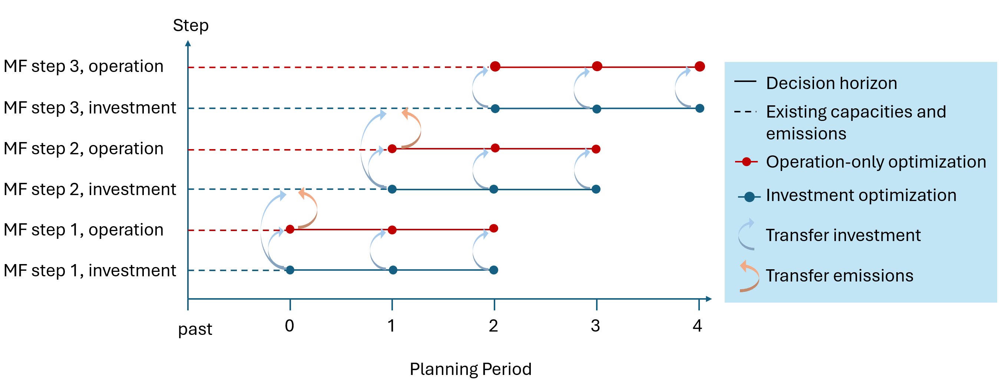

.. _t_operation_only.t_operation_only:

########################################
Tutorial 5: Operation-Only Optimizations
########################################

In some cases, it may be helpful run an operation-only version of ZEN-garden 
in which the investment in additional capacity is now allowed. This could 
for instance be the case when assessing the reliability of an given system or 
when estimating future wholesale electricity-prices.

.. tip::

    Many carriers (e.g. electricity) follow marginal pricing schemes where the 
    price is set by the short-term marginal production cost. Operation-only 
    models are required to realistically estimate these prices. Carrier prices 
    are typically derived from the dual variable of the nodal energy balance 
    constraint.  Recall that the dual variable (:math:`\lambda`) of a 
    constraint :math:`g(x) = 0` with an objective :math:`f(x)` is defined as:

    .. math::

        \lambda = \frac{\partial f}{\partial g}

    For cost minimization problems, the dual variable of the energy balance
    constraint thus measures the increase in total system cost required to 
    supply one additional unit of the carrier. In the standard capacity planning
    model, total system costs includes variable costs, fixed costs, and 
    capital costs. All three of these costs will be reflected in the 
    dual value, meaning that the dual value will be higher than real-world prices 
    in an energy-only marginal pricing system. In an operation-only model, 
    capital and fixed costs are constant. The dual variables thus gives a true
    representation of the short-run marginal production cost. 


ZEN-garden provides two methods for running operation-only models:

1. A configuration in ``system.json`` called ``allow_investment`` which allows users
   to allow/disallow new capacity installations in the model. When `false` new
   capacity additions are prohibited. In this case, all capacities (including 
   future capacities) must be pre-specified in the model as existing capacities.

2. A configuration in ``system.json`` called ``include_operation_only_phase`` which
   allows users to automatically run an operation-only optimization directly after
   any other ZEN-garden optimization. Capacities in the operation-only 
   optimization are taken directly from the investment decisions in the original 
   parent problem. 

In general, using former method is more customizable but requires more upfront
preparation to configure the existing capacities. The latter method is more 
efficient for simple applications (e.g. obtaining electricity prices), but 
is more limited in in uses.

This tutorial goes into detail on the  second method 
(``include_operation_only_phase``) since this method is more complex to 
understand and customize. Users seeking to implement the ``allow_investment`` 
method should refer to the sections on 
:ref:`setting configurations <t_configuration.t_configuration>` and
:ref:`input handling <input_handling.input_handling>` 


.. _t_operation_only.include_operation_only_phase:

Method: ``include_operation_only_phase``
========================================


.. _t_operation_only.setup:

Setup 
-----


The system configuration ``include_operation_only_phase`` allows users to append
an operation-only optimization to their original ZEN-garden model. To include 
this operations-only phase add the following entry to the ``system.json`` file:

.. code:: json

        { 
          // Additional system configurations go here
          "include_operation_only_phase": true
        }

.. _t_operation_only.results:

Results
-------

Variables and duals from the operation-only optimization are stored in the same 
output files as created for the original parent optimization. The names of 
operation-only variables are duals are stored with the suffix ``_operation`` to 
distinguish them from their phase 1 counterparts. 

The solver configuration ``selected_saved_duals_operation`` allows users to 
choose which dual values are saved from the operation-only optimization. 
Similarly, the solver configurations ``selected_saved_variables_operation`` 
allows users to chose which variables to save from the operation-only problem. 
These can be configurations can added to the ``config.json`` file as follows:

.. code:: JSON
    
    {
      "analysis": {
        // Additional analysis fields go here
      },
      "solver": {
        // Additional solver fields go here
        "selected_saved_duals": ["constraint_nodal_energy_balance"],
        "selected_saved_variables_operation": ["flow_conversion_input", "storage_level"],
      }
    }

.. _t_operation_only.myopic_foresight:

With myopic foresight
---------------------

.. _t_operation_only.fig_myopic_foresight_and_operation_only:



    Schematic diagram of the optimization steps when the operation-only
    optimizations are combined with myopic foresight. The above diagram shows
    a problem with a ``years_in_rolling_horizon`` of 3 years. The lines 
    represent individual optimization problems that ZEN-garden solves. 
    Points are the different planning periods included within those problems.
    Points in red are periods where new capacity investments are prohibited 
    whereas points in blue are periods where investments are optimized.
    For arrows indicate investment decisions and emsisions decisions that 
    are transferred to existing capacities and emissions in later optimizations. 

The ``include_operation_only_phase`` method is fully compatible with 
ZEN-garden's myopic foresight (MF) functionality. The :ref:`figure below 
<t_operation_only.fig_myopic_foresight_and_operation_only>`
shows the basic setup for optimizations with both features. A separate operation-
only optimization is completed for each step of the myopic foresight 
problem. 

The first optimization (MF step 1, investment) optimizes investment from the 
present planning period (year 0) to the end of the decision horizon (year 2). 
The second optimization (MF step 1, operation) then optimizes operation over the 
the same decision horizon (years 0 to 2). This operation-only problem uses the 
investment decisions from the first optimization, as shown by the blue arrows.
Investment decisions for all three years are transferred from the first 
optimization to the second optimization.

Next, the third optimization (MF step 2, investment) starts in year 1 and 
optimizes investment over the new decision horizon (years 1 tp 3). For this
problem, year 0 is now in the past. Investment decisions for this year are 
thus fixed at their values from the first optimization (MF step 1, 
investment) as shown by the big blue arrow on the diagram. Similarly, emissions
for year zero are fixed a their values from the second optimization (MF step 1,
operation), as shown by the red arrow. The process continues with a fourth 
optimization (MF step 2, operation), which optimizes operation for years 1 to 3.


Finally, this process is repeated until the last planning period is reached. 
For each step in the myopic foresight problem, an additional operation-only 
problem is introduced. The final results object will only show variable values f
or the first planning period of each optimization. 


.. _t_operation_only.example:

Example
-------

Download the run the example dataset ``5_multiple_time_steps_per_year`` as described 
in the :ref:`tutorial setup <tutorials_intro.setup>`.  Use this model to answer
the following question:

1. **What are the electricity prices in year 2022 (the first simulation year)?
   How do price estimates vary if you look at the dual of the nodal electricity 
   energy-balance in the full capacity planning problem versus the 
   operation-only model?**


   To answer this question, use the following steps:

   a. In the dataset example, modify the ``system.json`` configurations to set 
      the configuration ```include_operation_only_phase`` to ``true`` (as 
      previously described). This will run an operation-only model after the 
      main optimization.
   b. In the ``config.json`` file, set the solver configuration ``save_duals``
      to true. This ensures that the dual variables are saved in the results.
      
      .. code:: json

        {
          "analysis": {
            // Additional analysis fields go here
          },
          "solver": {
            // Additional solver fields go here
            "save_duals": true,
          }
        }

   c. Run the example dataset.
   d. Use the following results code to plot the results:

      .. code:: python
        
        from zen_garden.postprocess.results.results import Results
        from matplotlib import pyplot as plt
        import numpy as np

        r = Results(path='./data/outputs/5_multiple_time_steps_per_year')

        # get dual variables from capacity planning problem
        dual = r.get_full_ts(
          'constraint_nodal_energy_balance', 
          index = ('electricity', 'CH'), 
          year = 0
        )

        # get dual variables from the operations-only model
        dual_operation = r.get_full_ts(
          'constraint_nodal_energy_balance_operation', 
          index = ('electricity', 'CH'), 
          year = 0
        )

        # plot
        plt.figure()
        plt.plot(np.transpose(dual), c = 'r', label = 'capacity planning')
        plt.plot(
          np.transpose(dual_operation), 
          c = 'b', 
          ls = '--', 
          label = 'operation only'
        )
        plt.xlabel('Hour')
        plt.ylabel('Price (MEuro/GW)')
        plt.legend()
        plt.show()

      .. figure:: ../figures/tutorials/operation_only_example_prices.png
          :figwidth: 550 pt
          :align: center

          Prices from the original (capacity planning) and the operation-only 
          model. 


   *Solution: A price spike in the capacity planning model occurs in the 
   hour where electricity demand is highest. In this hour, adding
   additional capacity would require installing an additional unit of
   electricity generating capacity. These capacity costs are reflected
   in the price. In contrast, the operation-only model shows electricity 
   prices equal to the marginal cost of electricity production in 
   all hours* 
    
.. note::
  With some solvers, the operation-only price in the 
  highest-load hour might equal the price of lost load. 

.. tip:: 

  The units of the dual variables can be identified using the definition
  :math:`\lambda = \frac{\partial f}{\partial g}`. The units of the dual
  are simply the units of the objective function divided by the units of 
  the constraint. The units of both can be discovered using the results 
  functions ``r.get_unit('cost_total')`` and 
  ``r.get_unit('flow_conversion_output')``, respectively.


  


