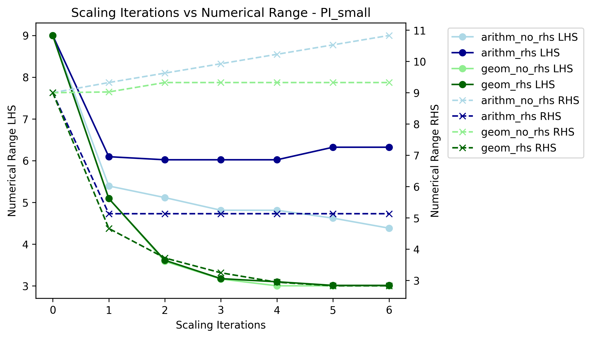
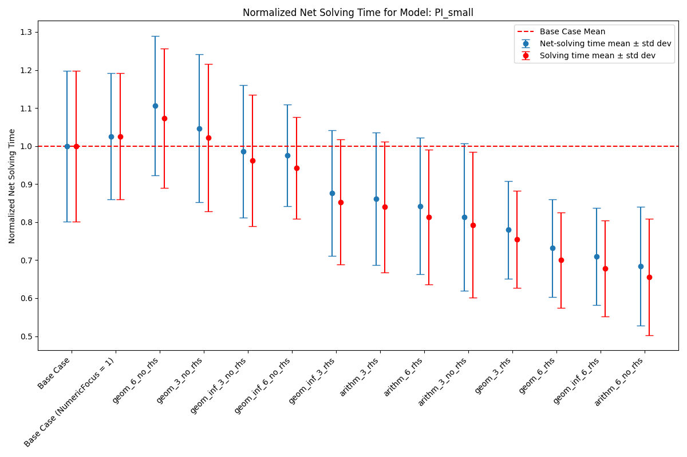
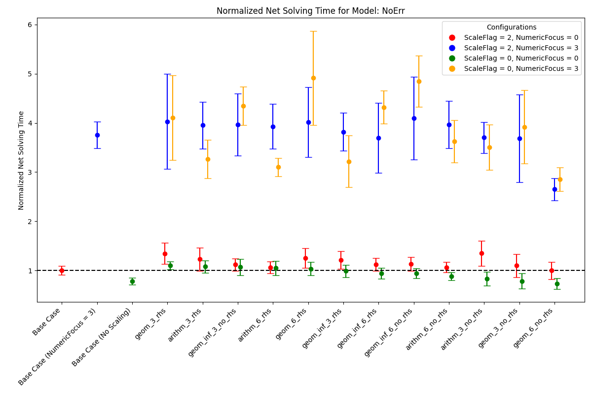
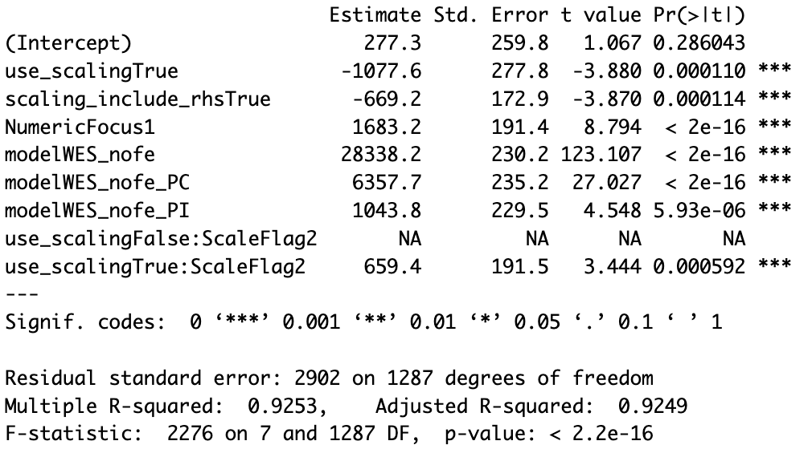

.. _t_scaling.t_scaling:

Tutorial 5: Scaling
===================

What is scaling and when to use it?
-----------------------------------
Simply put, with scaling we aim at enhancing the numeric properties of a given 
optimization problem, such that solvers can solve it more efficiently and 
faster. It is generally recommended to include scaling, if the optimization 
problem at hand faces numerical issues or requires a long time to solve.

Scaling is done by transforming the coefficients of the decision variables in 
both constraints and objective function to a similar order of magnitude.
In more mathematical terms, consider an optimization problem of the form:

.. math::

    \text{minimize} \quad & c^T x \\
    \text{subject to} \quad & Ax \leq b \\

Where :math:`x \in \mathbb{R}^n` is the vector of decision variables, 
:math:`A \in \mathbb{R}^{m \times n}` is the constraint matrix, :math:`b \in 
\mathbb{R}^m` is the right-hand side vector and :math:`c \in \mathbb{R}^n` is 
the cost vector. Note, that in ZEN-garden the constraints and optimization 
problem formulation can be generally of any form, however, for simpler 
notation we consider here the above form. If we now choose appropriate positive 
values for the column scaling vector :math:`s = [s_1, s_2, ..., s_n]` and row 
scaling vector :math:`r = [r_1, r_2, ..., r_m]`, we can scale the optimization 
problem with the two diagonal matrices :math:`S = diag(s)` and 
:math:`R = diag(r)`, such that the scaled optimization problem is:

.. math::

    \text{minimize} \quad & c^T S x \\
    \text{subject to} \quad & R A S x \leq R b

If done successfully the scaled optimization problem has beneficial numeric 
properties such that it is less computational expensive to solve compared to the 
original formulation. Note that the objective value remains the same and that 
the problem's solution is rescaled automatically within ZEN-garden so that also 
the decision variables are in the original scale.

Scaling Algorithms
------------------

In ZEN-garden we provide 3 different scaling algorithms, from which the row and 
column scaling vector entries are determined:

1. (Approximated) Geometric Mean (``"geom"``)
2. Arithmetic Mean (``"arithm"``)
3. Infinity Norm (``"infnorm"``)

The approximated geometric mean is the root of the product of the maximum and 
minimum absolute values of the respective row or column of the constraint matrix 
:math:`A`. The arithmetic mean is derived over all absolute values of the 
respective row or column of the constraint matrix :math:`A`. The infinity norm 
is the maximum absolute value of the respective row or column of the constraint 
matrix :math:`A`. For a more detailed explanation of each algorithm please 
see the paper from `Elble and Sahinidis (2012) <https://rdcu.be/dStfc>`_.

**Combination of Scaling Algorithms**

While the scaling algorithms can be used individually, they can also be 
combined. In this case, over multiple iterations you can apply a sequence of 
different scaling algorithms. See :ref:`t_scaling.how_to_scale` for 
more information.

**Right-Hand Side Scaling**

Furthermore, for all of the above mentioned algorithms, also the right-hand side 
vector :math:`b` can be included in the scaling process. If included, the chosen 
algorithm determines the row scaling vector entry for a specific row :math:`i` 
over all entries of that row in the constraint matrix :math:`A_{i*}` while also 
considering the respective right-hand side entry :math:`b_i`.

.. _t_scaling.how_to_scale:

How to use scaling in ZEN-garden?
---------------------------------

As described in, :ref:`configuration.configuration` in the :ref:`configuration.solver` section, scaling can 
be activated by adjusting the ``analysis.json`` file. The scaling configuration 
can be chosen through the following three settings:

1. ``use_scaling``: Boolean, whether scaling should be used or not.
2. ``scaling_algorithm``: List of strings, the scaling algorithms to be used. 
   Possible entries are: ``"geom"``, ``"arithm"``, ``"infnorm"``. The length of 
   the list determines the number of iterations.
3. ``include_rhs``: Boolean, whether the right-hand side vector should be 
   included for determining the row scaling vector or not.

For example, the following configuration would use a combination of two 
iterations of the geometric mean scaling followed by one iteration of the 
infinity norm algorithm as well as taking into account the right-hand side 
vector:

.. code-block::

  "solver": {
    "use_scaling": true,
    "scaling_algorithm": ["geom", "geom","infnorm"],
    "scaling_include_rhs": true
  }

The default configuration are three iterations of the geometric mean scaling 
algorithm with right-hand-side scaling.

.. _t_scaling.scaling_recommendations:

Recommendations for using scaling
---------------------------------
Here are some recommendations on what configuration to use and when and when not 
to use scaling. These rules were derived from the results of benchmarking the 
scaling procedure on different optimization problems as shown :ref:`t_scaling.benchmarking_results`. Please note that these recommendations are general and are likely 
to not apply to all optimization problems. They rather serve as a starting 
configuration which then can be adjusted based on the problem at hand via for 
example trial and error.

**Which algorithm to choose and how many iterations?**

The benchmarking indicated a convergence of the numerical range of the scaled 
optimization problem mostly after the third iteration. Therefore, it is 
recommended to use at least three iterations of the scaling algorithm. The 
geometric mean scaling algorithm and the combination of geometric mean followed 
by infinity norm scaling showed the overall best performance across the 
considered optimization problems. Therefore, it is recommended to use one of the 
following configurations:

* ``scaling_algorithm``: ``["geom", "geom", "geom"]``
* ``scaling_algorithm``: ``["geom", "geom", "infnorm"]``

**When to include the right-hand side vector?**

The benchmarking showed that including the right-hand side vector in the scaling 
process leads to a better performance of the solver for almost all optimization 
problems considered. Therefore, it is recommended to include the right-hand side 
vector in the scaling process by setting ``scaling_include_rhs``: ``True``.

**When not to use scaling?**

If the optimization problem already has a good numerical range (which can be 
checked with ``"solver": {"analyze_numerics": true}``), scaling might not be 
necessary. Also if the optimization problem already solves fast, the time 
necessary for scaling the problem might outweigh the time savings from solving 
the scaled optimization problem. As a rule of thumb, if the time to solve the 
optimization problem is in similar order of magnitude as the time to scale the 
problem, scaling should not be applied. The time necessary for scaling can be 
checked in the output of the optimization problem, if scaling is applied.

**How to deal with other complementary solver settings?**

Some solvers might also have their own scaling algorithms or other algorithms to 
improve the numerical properties of the optimization problem. In our 
benchmarking, we examined the interaction of the respective functionalities of 
Gurobi and scaling in ZEN-garden. Gurobi has the two options ``ScaleFlag`` and 
``NumericFocus`` that aim at improving numerical properties. The following 
recommendations can be given based on the results of the benchmarking:

* ``NumericFocus`` should be set to its default value ``0``.
* ``ScaleFlag`` should be set to ``0`` (off) as the scaling in ZEN-garden 
  already takes care of scaling the optimization problem and scaling the problem 
  twice led on average to longer solving times. However, this varied across the 
  optimization problems and therefore this again serves more as a default value 
  to start with and should be tested for the specific problem at hand.

For similar functionalities in other solvers, it is recommended to test the 
interaction of the respective functionalities with the scaling in ZEN-garden via 
trial and error.

.. _t_scaling.benchmarking_results:

Results of benchmarking
-----------------------
The scaling functionality was benchmarked by running the following set of models 
with various scaling configurations:

.. csv-table:: Models used for benchmarking
    :header-rows: 1
    :file: tables/benchmarking_model.csv
    :widths: 10 20 10 10 10 10
    :delim: ;

Overall, for the purpose of benchmarking over all models a total number of 3250 
runs were collected. The following sections will display the results of the 
benchmarking analysis and should provide insights about the effectiveness and 
functionality of the scaling algorithm.

**Numerical Range vs. Number of Iterations**

As argued in :ref:`t_scaling.scaling_recommendations` the numerical range showed 
convergence in most cases after just three iterations. The following results of 
running the scaling algorithms geometric mean (``geom``) and arithmetic mean 
(``arithm``) for the model ``PI_small`` for different number of iterations, 
portrays this result:

The dots indicate the left-hand side (LHS) range, which corresponds to the range 
of the A-matrix :math:`A`, whereas the crosses represent the numerical range of 
the right-hand side (RHS) vector :math:`b`. Light colors indicate the respective 
scaling configurations that exclude the right-hand side in the derivation of the 
row scaling vector.

From the plot we can observe:

* convergence of the numerical range (of the LHS) is visible for both algorithms 
  after three iterations
* a trade-off between a lower LHS range and also decreasing the RHS range may 
  exist, which is visible in case of arithmetic mean scaling
* neglecting the RHS may lead to a significant increase in its numerical range, 
  which is visible for both scaling algorithms (as shown in 
  :ref:`t_scaling.regression_analysis` this also leads on average to longer solving 
  times)

Net-solving time comparison for multiple scaling configurations
^^^^^^^^^^^^^^^^^^^^^^^^^^^^^^^^^^^^^^^^^^^^^^^^^^^^^^^^^^^^^^^

The following plots show the net-solving time (solving time + scaling time) for 
the models ``PI_small`` and ``NoErr``. These models were chosen as they 
represent very different results in terms of effectiveness of scaling. The model 
``PI_small`` showed mostly a significant decrease in net-solving time when 
scaling was applied, whereas the model ``NoErr`` showed no significant effect of 
scaling on the net-solving time or even worse an increase in solving-time.

Note, that the notation used for the ticks on the x-axis follows the pattern 
``<scaling_algorithm>_<number of iterations>_<include_rhs>``. For example, 
``geom_3_rhs`` indicates the geometric mean scaling algorithm with three 
iterations and including the right-hand side vector for deriving the row scaling 
vector. A combination of ``geom`` and ``infnorm``, where geometric mean scaling 
is followed by infinity norm scaling, is indicated by ``geom_infnorm``.

1. ``PI_small``

Note that the ``Base Case`` refers to a configuration where Gurobi scaling with 
a ``NumericFocus`` of ``0`` is applied, but no scaling in ZEN-garden. Since for 
this model all scaling configurations that use ZEN-garden are run with a fixed 
``NumericFocus`` of ``1`` (corresponding to low numeric focus), we also included 
a ``Base Case`` configuration with a ``NumericFocus`` of ``1`` for comparison. 
The red dotted line indicates the arithmetic mean of the net-solving time for 
the base case configuration. Red dots represent the solving time without the 
time spent on scaling the problem, whereas the blue dots represent the 
net-solving time that includes both.

The plot shows:

* a significant decrease in net-solving time for the model ``PI_small`` for a 
  majority of the considered algorithms when ZEN-garden scaling is applied
* on average configurations that include the right-hand side vector for deriving 
  the row scaling vector indicate a better performance
* solving times are very inconsistent leading to large variances in the 
  net-solving time for each scaling algorithm
* scaling time only makes up a small fraction of the net-solving time

2. ``NoErr``

In the analysis of the model ``NoErr`` we set special focus on the interaction 
and compatibility of ZEN-garden scaling with the numeric settings of Gurobi. 
For this we included for each algorithm four configurations with different 
combinations of ZEN-garden scaling and Gurobi's ``ScaleFlag`` and 
``NumericFocus``. A ``ScaleFlag`` of ``2`` indicates that Gurobi scaling is 
turned on and thus double scaling (ZEN-garden and Gurobi) is applied. A 
``NumericFocus`` of ``0`` indicates an automatic numeric focus, whereas a 
``NumericFocus`` of ``3`` indicates high numeric focus. Again, the base cases 
correspond to no ZEN-garden scaling.

From the plot we can derive:

* a configuration where no scaling is applied (neither ZEN-garden nor Gurobi) 
  can also lead to the best performance (as indicated by ``Base Case 
  (No Scaling)``)
* double scaling (ZEN-garden and Gurobi scaling) does not seem to be beneficial 
  and rather increases the net-solving time
* setting a high numeric focus increases the net-solving time significantly for 
  all scaling configurations
* only for a very few algorithms net-solving time is decreased when ZEN-garden 
  scaling is applied and only for an automatic numeric focus and no Gurobi 
  scaling

The two examples shown here, again indicate that deriving a general 
recommendation for the scaling configuration is difficult and that the 
performance of the scaling algorithm is highly dependent on the optimization 
problem at hand. Therefore, we recommended to test different scaling algorithms 
and configurations via trial and error.

.. _t_scaling.regression_analysis:

Regression Analysis
^^^^^^^^^^^^^^^^^^^

Based on the collected data from the benchmarking runs for the models 
``PI_small``, ``WES_nofe``, ``WES_nofe_PI``, and ``WES_nofe_PC``, a regression 
is run with the net-solving time (solving time + scaling time) as the dependent 
variable. The explanatory variables are the models, the ``use_scaling`` boolean, 
the ``include_rhs`` boolean, the ``NumericFcous`` (:math:`0` or :math:`1`) 
setting of Gurobi as well as an interaction term between ZEN-garden scaling and 
Gurobi's ``ScaleFlag``. The results of the regression analysis are the 
following:

The key takeaways from the regression analysis are:

* including ZEN-garden scaling decreases the net-solving time significantly
* including the RHS for the derivation of the row scaling vectors decreases the 
  net-solving time significantly
* choosing a low ``NumericFocus`` instead of the automatic one, increases the 
  net-solving time significantly
* double scaling, which means scaling both in ZEN-garden as well as within the 
  solver (here Gurobi), seems to increase the net-solving time significantly

Please note, that these results can not be generalized. They only represent the 
average effect observed for the models considered here and might vary from case 
to case.

