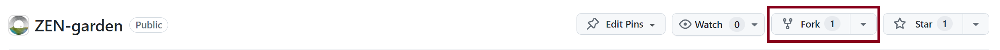

.. _installation:
################
Installation
################

ZEN-garden is written in Python and is available as a package. You can either install it via pip or fork and clone the repository from GitHub.
We recommend the first option for users who want to use ZEN-garden as a black-box optimization tool. The second option is for developers who want to contribute to the codebase.

.. _For users:
For users (direct installation)
=========
If you want to use ZEN-garden as a black-box optimization tool, you can install the package via `pip <https://pypi.org/project/zen-garden/>`_ in a terminal or command prompt.

We recommend working from a conda environment for the installation. If you have not installed Anaconda, you can download it `here <https://docs.anaconda.com/anaconda/install/>`_. You can check if you have Anaconda installed by running the following command in a terminal (MacOS)/command prompt (Windows)::

    conda --version

You can quickly create an environment with the following command::

  conda create -n <your_env_name> python=<python_version>

Replace ``<your_env_name>`` with the name of your environment and replace ``<python_version>`` with the necessary python version (see `ZEN-garden README <https://github.com/ZEN-universe/ZEN-garden/blob/main/README.md>`_).

Activate the environment with the following command::

  conda activate <your_env_name>

Now you can install the zen-garden package with the following command::

    pip install zen-garden

.. note::

    To get started with small example models, check out :ref:`Running ZEN-garden from a terminal`.

.. _For developers:
For developers (forking the repository)
==============
If you want to work on the codebase, you can fork and clone the repository from `GitHub <https://github.com/ZEN-universe/ZEN-garden>`_.

If it's your first time using GitHub, register at `<https://github.com/>`_. After you have created an account, you can fork and clone the repository.

Navigate to `<https://github.com/ZEN-universe/ZEN-garden>`_ on Github and click on the "Fork" button at the top right corner of the page to create a copy of the repository under your account and select yourself as the owner.

**Clone your forked repository:**

Clone your forked repository by running the following lines in `Git-Bash <https://git-scm.com/downloads>`_::

    git clone git@github.com:<your-username>/ZEN-garden.git
    cd ZEN-garden

Substitute ``<your-username>`` with your Github username. If you gave the forked repository a different name, replace ``ZEN-garden`` with the name of your repository.

.. note::
    If you get the permissions error "Permission denied (publickey)", you will need to create the SSH key. Follow the instructions on `how to generate an SSH key <https://docs.github.com/en/authentication/connecting-to-github-with-ssh/generating-a-new-ssh-key-and-adding-it-to-the-ssh-agent#generating-a-new-ssh-key>`_ and then `how to add it to your account <https://docs.github.com/en/authentication/connecting-to-github-with-ssh/adding-a-new-ssh-key-to-your-github-account#adding-a-new-ssh-key-to-your-account>`_. You will not need to add the SSH key to the Agent, so only follow the first website until before `Adding your SSH key to the ssh-agent <https://docs.github.com/en/authentication/connecting-to-github-with-ssh/generating-a-new-ssh-key-and-adding-it-to-the-ssh-agent#adding-your-ssh-key-to-the-ssh-agent>`_

**Track the upstream repository:**

Track the upstream repository by running the following lines in Git-Bash::

    git remote add upstream git@github.com:ZEN-universe/ZEN-garden.git
    git fetch upstream

**Create the ZEN-garden conda environment:**

Open the Anaconda prompt. Change the directory to the root directory of your local ZEN-garden repository where the file ``zen_garden_env.yml`` is located::

  cd <path_to_zen_garden_repo>

Now you can install the conda environment for zen-garden with the following command::

  conda env create -f zen_garden_env.yml

The installation may take a couple of minutes. If the installation was successful, you can see the environment at ``C:\Users\<username>\anaconda3\envs`` or wherever Anaconda is installed

.. note::
    We strongly recommend working with conda environments. When installing the zen-garden conda environment via the ``zen_garden_env.yml``, the zen-garden package, as well as all other dependencies, are installed automatically. 

Solver options
==============

ZEN-garden passes the optimization problem to an external solver, per default, the open source solver `HiGHS <https://highs.dev/>`_ is selected. Alternatively, the commercial solver `Gurobi <https://www.gurobi.com/>`_ can be used. Academic licenses are available for free and allow you to access all of Gurobi's functionalities. You can get your Gurobi license `here <https://www.gurobi.com/features/academic-named-user-license/>`_. Follow the instructions to retrieve your Gurobi license key and activate the license for your computer.
