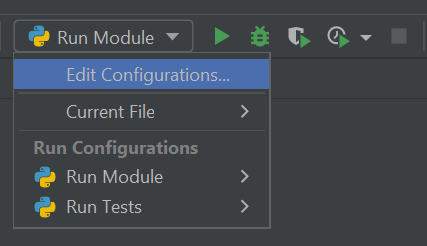
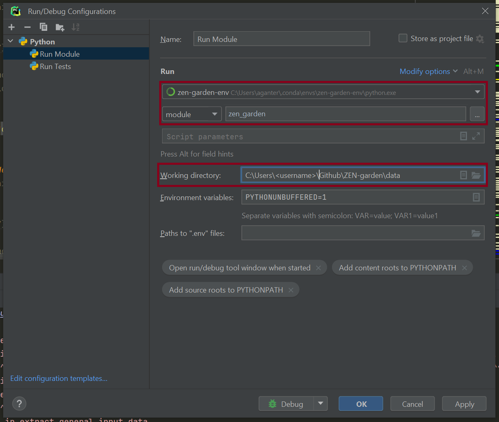

.. _Running a model:

###############
Running a model
###############

.. _Running ZEN-garden as a Model-User:

Running ZEN-garden as a Model-User
==================================

Activate the environment
------------------------

To run ZEN-garden from a terminal, activate the environment where you installed ZEN-garden. If you downloaded ZEN-garden from pip (``pip install zen-garden``, :ref:`Install for users`), activate the environment where you installed ZEN-garden.

.. code-block::

    conda activate <your_environment>

If you installed ZEN-garden from the repository and created a new environment (:ref:`Install for developers`), per default, the environment will be called ``zen-garden``::

  conda activate zen-garden

.. _Run example:

Run ZEN-garden with an example dataset
--------------------------------------

To run ZEN-garden with an example dataset (see :ref:`dataset_examples`), first move to the directory where you want to execute the optimization. You can do that with the command ``cd`` in a terminal or command prompt::

    cd /path/to/your/data

Then execute the following line::

  python -m zen_garden --example=<example_name>

Substitute ``<example_name>`` with the name of the example dataset you want to run. For example, to run the example dataset ``1_base_case``, execute the following line::

  python -m zen_garden --example="1_base_case"

This command is particularly useful when you installed ZEN-garden from pip and do not have the repository on your local machine.

.. note::
    Dataset examples are an easy and quick way to get started with your model.
    Find an example that best suits your need and use it as a template to build your own model (see :ref:`dataset_examples`).

The example dataset and the ``config.json`` file will be downloaded, a new folder will be created in the working directory, and the optimization will be run. No prior setup is needed.

The optimization results will be stored in ``dataset_examples/outputs``. A Jupyter notebook will be downloaded to give you fast access to your results (see more at `Analyzing a model <analyzing_models.rst>`_).

.. note::

    You can also use the visualization platform to analyze the results (see :ref:`Visualization`). To do so, move to the newly created ``dataset_examples`` folder after the optimization has finished::

        cd dataset_examples

    and run the visualization platform::

        python -m zen_garden.visualization

.. _Run ZEN-garden with preexisting datasets:

Run ZEN-garden with preexisting datasets
----------------------------------------

If you already have a model that you want to run, change your path to the working directory, i.e. the directory that contains the ``config.json``. This directory will also be used to save the results::

  cd /path/to/your/data

.. note::
    You can create the data folder in the ZEN-garden root folder, but it will not be uploaded to Github (it is in the ``.gitignore`` file).
    This way, you can keep your data separate from the repository. **However, we recommend keeping the data folder in a different location than the ZEN-garden source code.**

Execute the following lines to run ZEN-garden::

  python -m zen_garden

When running the previous line, ZEN-garden will attempt to run the dataset specified in ``analysis/dataset`` in ``config.json``. You can change the dataset via the dataset argument::

  python -m zen_garden --dataset=<my_dataset>

If you have multiple ``config.json`` files in your working directory, you can specify the file you want to use with the ``config`` argument::

  python -m zen_garden --config=<my_config.json> --dataset=<my_dataset>

Running ZEN-Garden as a Model-Developer
=======================================

This section requires that ZEN-Garden repository is forked as described in (see :ref:`Install for developers`). When the repository is forked, the code from the fork will be used to execute the module whenever ZEN-garden is called. The procudure for running Zen-garden as a developer differs from that of a user since developers must be able to not only run the module but also debug the module and edit the code.

There are two ways to run ZEN-Garden as a developer: 

1. Import the module and run the module in a python script
2. Use terminal commands, as in :ref:`Running ZEN-garden as a Model-User`. In this case, the python IDE (e.g. VSCode or PyCharm) need to be specially configured to enable debugging.  
  
  
The sections below describe each of these two methods in detail. 

.. note::
    When running ZEN-Garden as a developer, always make sure that the python environment is up to date with the current model version. This means that the ZEN-garden environment should be re-installed each time you pull a new version from the repository. Otherwise, dependancy changes may result in errors.

Run ZEN-garden using a Python Script
------------------------------------

ZEN-Garden can be run by importing the module in a python script and calling the Run_Module function. This can be done via the following code:

.. code-block:: python

  from zen_garden.__main__ import run_module
  import os

  os.chdir("<path\to\data>")
  run_module(dataset = "<dataset_name>")

The script reflects two core requirements for running ZEN-garden. First, ZEN-garden must be executed from the directory in which the model input data is located. Second, the dataset which to use in the model needs to be specified. 

The ``run_module`` is equivalent to running the model via the command line. All command line flags can be specified as optional keyword arguments in the function. The two codes below demonstrate, for instance how to run an example problem and specify a config file, respectively.

.. code-block:: python

  from zen_garden.__main__ import run_module
  import os

  os.chdir("<path\to\data>")
  run_module(example="1_base_case")

.. code-block:: python

  from zen_garden.__main__ import run_module
  import os

  os.chdir("<path\to\data>")
  run_module(dataset = "<dataset_name>", 
             config="<my_config.json>")

The avantage of running ZEN-garden as a script is that standard debug functionalities can be easily applied to the model.

Run ZEN-garden using a Python Script
------------------------------------

Alternatively, developers may also run ZEN-garden using terminal commands as described in :ref:`Running ZEN-garden as a Model-User`. In this case, special configurations need to be set in the python IDE being used to enable debugging. These configurations are described below for two common IDEs: PyCharm and VSCode.

PyCharm configurations
^^^^^^^^^^^^^^^^^^^^^^^^^^^^^^^^^^^^^^^^^^^^^^^^^

To execute ZEN-garden with the PyCharm IDE you can use the configuration setup which can be found next to the run button, and click on "Edit configurations.." to edit or add a configuration.

Add a new configuration by clicking on the "+" button on the top left corner of the window. Choose ´´Python´´ as a type. You can name the configuration however you like. The important settings are:

- Change "Script Path" to "Module name" and set it to "zen_garden"
- Set the Python interpreter to the Conda environment that was used to install the requirements and ZEN-garden as a package. Per default, the environment will be called ``zen-garden``. **Important**: This setup will only work for Conda environments that were also declared as such in PyCharm; if you set the path to the Python executable, you will have to create a new PyCharm interpreter first.
- Set the "Working directory" to the path that contains the ``config.json``. This directory will also be used to save the results.

In the end, your configuration to run ZEN-garden as a module should look similar to this:

Once these configurations are set, the standard ``run`` and ``debug`` buttons of the PyCharm IDE can be used. When pressed, these buttons will create and execute the approriate terminal commands for running and debugging ZEN-Garden, respectively. Command line flags can be typed into the ``Script Parameters`` field of the Run/Debug configurtations.

VS code configurtations
^^^^^^^^^^^^^^^^^^^^^^^

To debug ZEN-garden with VSCode, follow these steps:

- select the correct interpreter: Press ctrl + shift + p to open the command palette (if you're on Windows or Linux), and enter ``Python: Select interpreter`` and make sure that the correct conda environment is selected. Per default, the conda enivronment will be called ``zen-garden``.
- Create a new file in the folder ``./.vscode/`` called ``launch.json`` with the following content:

.. code-block:: JSON

    {   
        "version": "0.2.0",
        "configurations": [
        {
          "name": "Python: ZEN-Garden",
          "type": "debugpy",
          "cwd":"<path to folder with dataset>",
          "request": "launch", "module": "zen_garden",
          "console": "integratedTerminal"
        }
      ]
    }

To debug ZEN-Garden, select ``Python Debugger: Debug using launch.json`` from the debug menu as shown in the figure. Note that no command line flags can be entered. The dataset must therefore be specified in the config.json file which is located in the datset folder. 

.. image:: images/VSCode_Debug.png
    :alt: VSCode Debug

