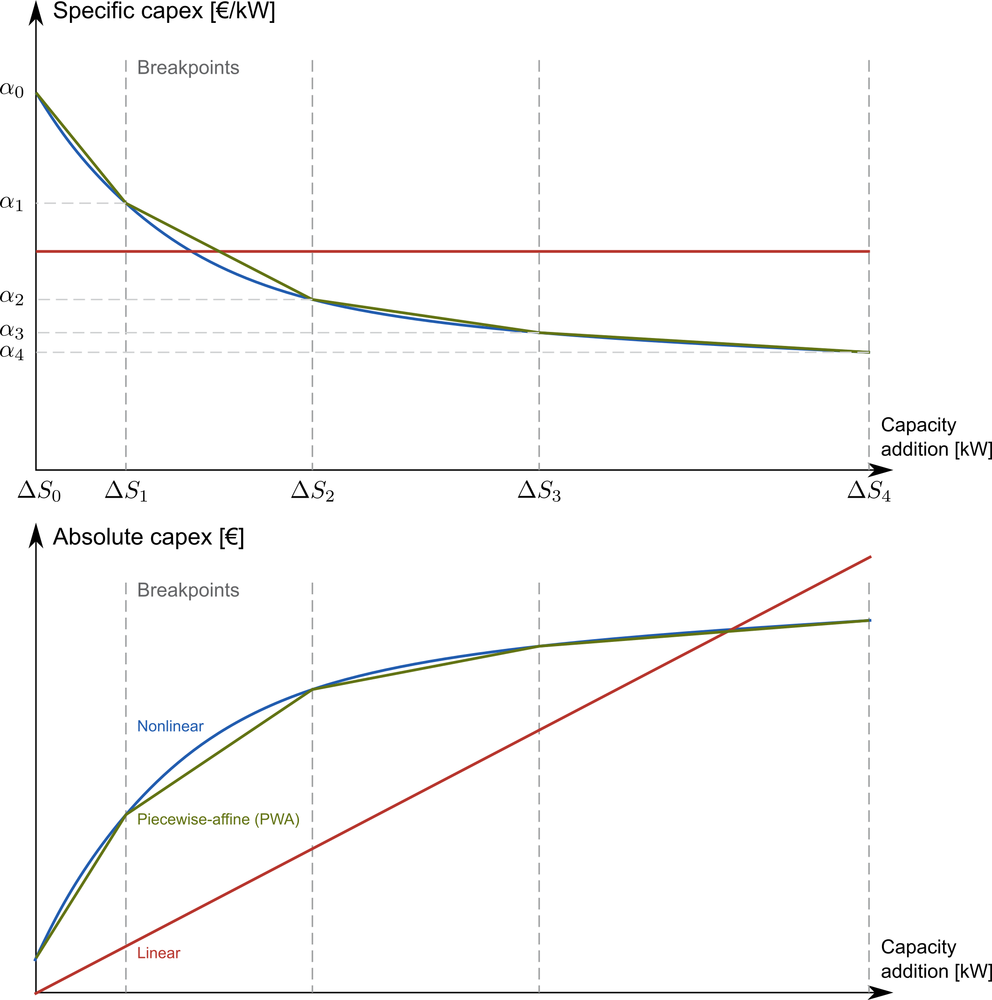

.. _input_structure.input_structure:

####################
Input data structure
####################

The input data is structured in a folder hierarchy. The root folder 
``<data_folder>`` contains a subfolder for each dataset and a configuration 
file ``config.json``. ZEN-garden is run from this root folder (:ref:`running.running`). 
The dataset folder ``<dataset>`` comprises the input data for a 
specific dataset and must contain the following files and subfolders:

.. code-block::

    <data_folder>/
    |--<dataset>/
    |   |--energy_system/
    |   |   |--attributes.json
    |   |   |--base_units.csv
    |   |   |--set_nodes.csv
    |   |   `--set_edges.csv
    |   |
    |   |--set_carriers/
    |   |   |--<carrier1>/
    |   |   |   `--attributes.json
    |   |   `--<carrier2>/
    |   |       `--attributes.json
    |   |
    |   |--set_technologies/
    |   |   |--set_conversion_technologies/
    |   |   |   |--<conversion_technology1>/
    |   |   |   |   `--attributes.json
    |   |   |   |
    |   |   |   `--<conversion_technology2>/
    |   |   |       `--attributes.json
    |   |   |
    |   |   |--set_storage_technologies/
    |   |   |      `--<storage_technology1>/
    |   |   |          `--attributes.json
    |   |   |
    |   |   `--set_transport_technologies/
    |   |       `--<transport_technology1>/
    |   |           `--attributes.json
    |   |
    |   `--system.json
    |
    `--config.json

Note that all folder names in ``<>`` in the structure above can be chosen 
freely. The dataset is described by the properties of the ``energy_system``, the 
``set_carriers``, and the ``set_technologies``. The system configuration is 
stored in the file ``system.json`` and defines dataset-specific settings, e.g., 
which technologies to model or how many years and time steps to include. The 
configuration file ``config.json`` contains more general settings for the 
optimization problem and the solver. Refer to the section :ref:`configuration.configuration`
for more details.

Depending on your analysis, more files can be added; see 
:ref:`input_structure.attribute_files` and 
:ref:`t_scenario.t_scenario` for more information.

.. _input_structure.folders:

Folders
^^^^^^^

.. _input_structure.energy_system:

Energy System
==============

The folder ``energy_system`` contains four necessary files: ``attributes.json``, 
``base_units.csv``, ``set_nodes.csv``, and ``set_edges.csv``. The file 
``attributes.json`` defines the numerical setup of the energy system, e.g., the 
carbon emission limits, the discount rate, or the carbon price. 
``set_nodes.csv`` and ``set_edges.csv`` define the nodes and edges of the energy 
system graph, respectively. ``set_nodes.csv`` contains the coordinates of the 
nodes, which are used to calculate the default distance of the edges.

There is no predefined convention for naming nodes and edges, so the user can 
choose the naming freely. In the examples, we use ``<node1>-<node2>`` to name 
edges, but note that you are not forced to follow that convention. In fact, 
``set_edges.csv`` defines the edges by the nodes they connect.

.. note::
    You can specify more nodes in ``set_nodes.csv`` than you end up using. In 
    ``system.json`` you can define a subset of nodes you want to select in the 
    model. If you do not specify any nodes in ``system.json``, all nodes from 
    ``set_nodes.csv`` are used.

``base_units.csv`` define the base units in the model. That means that all units 
in the model are converted to a combination of base units. See 
:ref:`t_units.t_units` for more information.

.. _input_structure.technologies:

Technologies
==============
The ``set_technologies`` folder is specified in three subfolders: 
``set_conversion_technologies``, ``set_storage_technologies``, and 
``set_transport_technologies``. Each technology has its own folder in the 
respective subfolder and must contain the ``attributes.json`` file. Additional 
files can further parametrize the technologies (see :ref:`input_structure.attribute_files`).

.. note::
    You can specify more technologies in the three subfolders than you end up 
    using. That can be helpful if you want to model different scenarios with 
    different technologies and carriers.

Each technology has a reference carrier, i.e., that carrier by which the 
capacity of the technology is rated. As an example, a :math:`10kW` heat pump 
could refer to :math:`10kW_{th}` heat output or :math:`10kW_{el}` electricity 
input. Hence, the user has to specify which carrier is the reference carrier in 
the file ``attributes.json``. For storage technologies and transport 
technologies, the reference carrier is the carrier that is stored or 
transported, respectively.

.. _input_structure.conversion_technologies:

Conversion Technologies
-----------------------

The conversion technologies are defined in the folder 
``set_conversion_technologies``. A conversion technology converts ``0`` to 
``n`` input carriers into ``0`` to ``m`` output carriers. Note that the 
conversion factor between the carriers is fixed, e.g., a combined heat and 
power (CHP) plant cannot sometimes generate more heat and sometimes generate 
more electricity. The file ``attributes.json`` defines the properties of the 
conversion technology, e.g., the capacity limit, the maximum load, the 
conversion factor, or the investment cost.

A special case of the conversion technologies are retrofitting technologies. 
These technologies are defined in the folder 
``set_conversion_technologies\set_retrofitting_technologies``, if any exist.
They behave equal to conversion technologies, but they are always connected to 
a conversion technology. They are coupled to a conversion technology by the 
attribute ``retrofit_flow_coupling_factor`` in the file ``attributes.json``, 
which couples the reference carrier flow of the retrofitting technology and the 
base technology. A possible application of retrofitting technologies is the 
installation of a carbon-capture unit on top of a power plant. In this case, 
the base technology would be ``power_plant`` and the retrofitting technology 
would be ``carbon_capture``. Refer to the dataset example 
``14_retrofitting_and_fuel_substitution`` for more information.

.. _input_structure.storage_technologies:

Storage Technologies
--------------------

The storage technologies are defined in the folder ``set_storage_technologies``.
A storage technology connects two time steps by charging at ``t=t0`` and 
discharging at ``t=t1``.

.. note::
    In ZEN-garden, the power-rated (charging-discharging) capacity and 
    energy-rated (storage level) capacity of storage technologies are optimized 
    independently.     If you want to fix the energy-to-power ratio, the 
    attribute ``energy_to_power_ratio`` in ``attributes.json`` can be set to 
    anything different than ``inf``.

Transport Technologies
----------------------

The transport technologies are defined in the folder 
``set_transport_technologies``. A transport technology connects two nodes via an 
edge. Different to conversion technologies or storage technologies, transport 
technology capacities are built on the edges, not the nodes.

.. note::
    By default, the distance of an edge will be calculated as the `haversine 
    distance <https://www.geeksforgeeks.org/haversine-formula-to-find-distance-between-two-points-on-a-sphere/>`_ 
    between the nodes. This can be overwritten for specific edges in a 
    ``distance.csv`` file (see :ref:`input_structure.attribute_files`).

.. _input_structure.carriers:

Carriers
==============

Each energy carrier is defined in its own folder in ``set_carriers``. You do not 
need to specify the used energy carriers explicitly in ``system.json``, but the 
carriers are implied from the used technologies. All input, output, and 
reference carriers that are used in the selected technologies 
(see `input_structure.technologies`_) must be defined in the ``set_carriers`` folder. The file 
``attributes.json`` defines the properties of the carrier, e.g., the carbon 
intensity or the cost of the carrier. Additional files can further parametrize 
the carriers (see :ref:`input_structure.attribute_files`).

.. note::
    You can specify more carriers in ``set_carriers`` than you end up using. 
    That can be helpful if you want to model different scenarios with different 
    technologies and carriers.

.. _input_structure.files:

Files 
^^^^^

.. _input_structure.attribute_files:

Attribute.json files
=========================
Each element in the input data folder has an ``attributes.json`` file, as shown 
in :ref:`input_structure.input_structure`, which defines the default values for the 
element. This file must be specified for each element and must contain all 
parameters that this class of elements (Technology, Carrier, etc.) can have 
(see :ref:`notation.notation`).

The ``attributes.json`` files have three main purposes:

1. Defining all parameters of each element
2. Providing the default value for each parameter
3. Defining the unit of each parameter

How are ``attributes.json`` files structured?
---------------------------------------------
The general structure of each ``attributes.json`` file is the following:

.. code-block::

    {
      "parameter_1": {
        "default_value": v_1,
        "unit": "u_1"
      },
      "parameter_2": {
        "default_value": v_2,
        "unit": "u_2"
      },
      ...
    }

The structure is a normal dictionary structure.
Make sure to have the correct positioning of the brackets.

* There is **one curly** bracket around all parameters ``{...}``
* Each parameter has a name, followed **by a colon and curly brackets** 
  ``name: {...}``
* Inside the curly brackets are in most cases a ``default_value`` as a ``float`` 
  or ``"inf"`` and a ``unit`` as a ``string`` (see :ref:`t_units.t_units`).

What are particular parameters in the ``attributes.json`` file?
---------------------------------------------------------------

Some parameters do not have the structure above. These are the carriers of 
technologies (``"reference_carrier"``, ``"input_carrier"``, and 
``"output_carrier"``), the ``"conversion_factor"`` of conversion technologies, 
and the ``"retrofit_flow_coupling_factor"`` of retrofitting technologies.

**Input, output, and reference carriers**

.. code-block::

    "output_carrier": {
      "default_value": [
        "heat",
        "electricity"
      ],
    }

The default value of the three carrier types are a list ``[..., ...]``. It can 
take the following lengths:

1. 1 carrier: Necessary in the case of the reference carrier
2. 0 carrier: Empty list if no input or output carrier
3. more than 1 carrier: for multiple input or output carriers

The units of the carriers in a technology are defined in the corresponding 
parameters (see :ref:`t_units.t_units`) and are therefore omitted in the
``"reference_carrier"``, ``"input_carrier"``, and ``"output_carrier"`` field.

**Conversion factor**

The ``conversion_factor`` is the fixed ratio between a carrier flow and the 
reference carrier flow, defined for all dependent carriers, i.e., all carriers 
except the reference carrier.

.. code-block::

    dependent_carriers = input_carriers + output_carriers - reference_carrier

ZEN-garden will check i) that the reference carrier is not part of the input and 
output carriers, ii) that there is no overlap between the input and output 
carriers, and iii) that all carriers are defined in their respective folders in 
``set_carriers``. The default conversion factor is defined in 
``attributes.json`` as:

.. code-block::

    "conversion_factor": [
      {
        "heat": {
          "default_value": 1.257,
          "unit": "GWh/GWh"
        }
      },
      {
        "natural_gas": {
          "default_value": 2.857,
          "unit": "GWh/GWh"
        }
      }
    ]

The conversion factor is **a list ``[...]`` with each dependent carrier wrapped 
in curly brackets**. Inside each curly bracket, there are the ``default_value`` 
and the ``unit``.

**Retrofitting flow coupling factor**

The retrofitting flow coupling factor couples the reference carrier flow of the 
retrofitting technology and the base technology 
(:ref:`input_structure.conversion_technologies`). The default value is defined in 
``attributes.json`` as:

.. code-block::

    "retrofit_flow_coupling_factor": {
      "base_technology": <base_technology_name>,
      "default_value": 0.5,
      "unit": "GWh/GWh"
    }

The retrofitting flow coupling factor is a single parameter with the base 
technology as a string and the default value and unit as usual.

.. _input_structure.overwrite_defaults:

Overwriting default values
===========================

The paradigm of ZEN-garden is that the user only has to specify those input data 
that they want to specify. Therefore, the user defines default values for all 
parameters in the ``attributes.json`` files. Whenever more information is 
required, the user can overwrite the default values by providing a 
``<parameter_name>.csv`` file in the same folder as the ``attributes.json`` 
file.

Let's assume the following example: The purpose of the energy system is to 
provide ``heat``, whose default ``demand`` is given as ``10 GW``:

.. code-block::

    {
      "demand": {
        "default_value": 10,
        "unit": "GW"
      }
    }

The energy system is modeled for two nodes, ``CH`` and ``DE`` and spans one year 
with 8760 time steps.

.. note::
    To retrieve the dimensions of a parameter, please refer to :ref:`notation.notation` 
    and to the ``index_names`` attribute in the parameter definition.

Providing extra .csv files
--------------------------

If the user wants to specify the demand ``CH`` and ``DE`` in the time steps 
``0, 14, 300``, the user can create a file ``demand.csv``:

.. code-block::

    node,time,demand
    CH,0,5
    CH,14,7
    CH,300,3
    DE,0,2
    DE,14,3
    DE,300,2

The file overwrites the default value for the demand at nodes ``CH`` and ``DE`` 
in time steps ``0, 14,300``.

.. note::
    ZEN-garden will select that subset of data that is relevant for the 
    optimization problem. If the user specifies a demand for a node in 
    ``demand.csv`` that is not part of the optimization problem, the demand is 
    ignored for this node.

To avoid overly long files, the dimensions can be unstacked, i.e., the values of 
one dimension can be the column names of the file:

.. code-block::

    node,0,14,300
    CH,5,7,3
    DE,2,3,2

or

.. code-block::

    time,CH,DE
    0,5,2
    14,7,3
    300,3,2

Therefore, the full demand time series is ``10 GW`` except for the time steps 
``0, 14, 300`` where it is ``5 GW, 7 GW, 3 GW`` for ``CH`` and ``2 GW, 3 GW, 2 
GW`` for ``DE``.

.. warning::
    Make sure that the unit of the values in the ``.csv`` file is consistent 
    with the unit defined in the ``attributes.json`` file! Since we do not 
    specify a unit in the ``.csv`` file, the unit of the values is assumed to be 
    the same as the unit in the ``attributes.json`` file.

Constant dimensions
-------------------

Often, we have parameters that are constant over a certain dimension but change 
with another dimension. For example, the demand of an industrial energy carrier 
might be constant over time but is different for all nodes.

In this case, the full ``demand.csv`` file would be:

.. code-block::

    node,0,1,2,...,8760
    CH,5,5,5,...,5
    DE,2,2,2,...,2

This is a very long file, and it is hard to see the structure of the data. 
Furthermore, it is prone to errors. Therefore, ZEN-garden allows you to drop 
dimensions that are constant. The file can be shortened to:

.. code-block::

    node,demand
    CH,5
    DE,2

The file is much shorter and easier to read. ZEN-garden will automatically fill 
in the missing dimensions with the constant value.

.. _input_structure.yearly_variation:

Yearly variation
----------------
We specify hourly-dependent data for each hour of the year.
However, some parameters might have a yearly variation, e.g., the overall 
demand may increase or decrease over the years.

To this end, the user can specify a file 
``<parameter_name>_yearly_variation.csv`` that multiplies the hourly-dependent 
data with a factor for each hour of the year. ZEN-garden therefore assumes the 
same time series for each year but allows for the scaling of the time series 
with the yearly variation. Per default, the yearly variation is assumed to be 
``1``. Therefore, for missing values in 
``<parameter_name>_yearly_variation.csv``, the hourly-dependent data is 
not scaled.

The user can specify the yearly variation for all dimensions except for the 
``time`` dimension:

.. code-block::

    node,2020,2021,2022,...,2050
    CH,1,1.1,1.2,...,4
    DE,1,0.99,0.98,...,0.7

If all nodes have the same yearly variation, the file can be shortened to:

.. code-block::

    year,demand_yearly_variation
    2020,1
    2021,1.1
    2022,1.2
    ...
    2050,4

.. note::
    So far, ZEN-garden does not allow for different time series for each year 
    but only for the scaling while keeping the same shape of the time series.

Data interpolation
------------------

To reduce the number of data points, ZEN-garden per-default interpolates the 
data points linearly between the given data points. As an example, in 
:ref:`input_structure.yearly_variation`, the demand increase or decrease is linear over the years.
So, the user can reduce the number of data points in the 
``demand_yearly_variation.csv`` file:

.. code-block::

    year,demand_yearly_variation
    2020,1
    2050,4

If the user wants to disable the interpolation for a specific parameter, the 
user can create a ``parameters_interpolation_off.json`` file and specify the 
parameter names in the file:

.. code-block::

    {
      "parameter_name": [
        "carbon_emissions_annual_limit",
        "demand_yearly_variation"
      ]
    }

.. note::
    The user must specify the file name, i.e., in the example above, the 
    specified file is ``demand_yearly_variation.csv``, not ``demand.csv``.
    Therefore, the interpolation is only disabled for the yearly variation, not 
    for the hourly-dependent data.

.. _input_structure.pwa:

Piece-wise affine input data
----------------------------
In ZEN-garden, we can model the capital expenditure (CAPEX) of conversion 
technologies either linear or piece-wise affine (PWA). In the linear case, the 
``capex_specific_conversion`` parameter is treated like every other parameter, 
i.e., the user can specify a constant value and a ``.csv`` file.

In the PWA case, the user can specify a ``nonlinear_capex.csv`` file that 
contains the breakpoints and the CAPEX values of the PWA representation.
A PWA representation is a set of linear functions that are connected at the 
breakpoints. The breakpoints are the capacity additions :math:`\Delta S_m` with 
the corresponding CAPEX values :math:`\alpha_m`.

The file ``nonlinear_capex.csv`` has the following structure:

.. code-block::

    capacity_addition,capex_specific_conversion
    0,2000
    20,1700
    40,1500
    60,1350
    80,1200
    100,1100
    120,1010
    140,940
    160,890
    180,860
    200,840
    GW,Euro/kW

.. note::

    Each new interval between two breakpoints adds a binary variable to the 
    optimization problem, for each technology, each year, and each node. The 
    binary variable is 1 if the capacity is in the interval and 0 otherwise.
    The user is advised to keep the number of breakpoints low to avoid a 
    combinatorial explosion of binary variables.